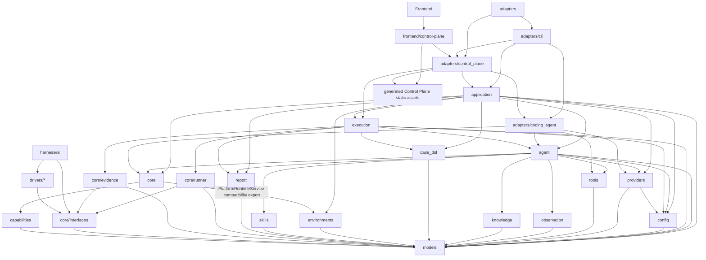

# fsq-agent Project Specification

Root `SPEC.md` is the project-level specification and module navigation source of truth. Each module also owns a module-level `SPEC.md`.

## Project Specification Ownership

Root `SPEC.md` and module `SPEC.md` files are the current factual baseline for implementation. They describe present behavior, public contracts, module ownership, dependency direction, configuration surface, error semantics, architecture level, and implementation invariants.

## Tool And Capability Execution

fsq-agent separates dynamic-only helper tools from recordable execution capabilities.

- AgentTools are OpenAI Agents SDK helper tools used only during dynamic execution. They include scoped file reads/writes and bounded run-artifact search/slice helpers. AgentTools are not strict replay capabilities, are not registered in FSQ capability registries, and are never recorded into generated strict YAML.
- CommonTools are recordable platform-default execution capabilities inherited by every active platform. The active CommonTool is `wait_ms`/`waitMs`. Runtime-secret credential input is represented on text-entry PlatformTools with `textType: runtimeSecret` and is resolved by execution core before driver invocation, not by an LLM-facing secret-fetch tool.
- PlatformTools are recordable active-platform capabilities. They include concrete backend driver actions, including backend-owned assertions such as `assert_with_ai`.

All recordable execution behavior is declared through decorator-driven capability metadata. The neutral `capabilities` module owns shared declaration decorators, catalog-backed platform validation, and reflection/discovery helpers that produce `models.CapabilityDefinition` records for CommonTools and PlatformTools. The capability registry is the source of truth for canonical names, replay aliases from `ReplayPolicy(kind="fsq_command")`, parameter schemas, tool family, replay policy, sensitivity, step kind, platform/backend ownership, and provenance. LLM-facing CommonTool and PlatformTool parameter schemas are generated from shared Pydantic parameter models and include concise field descriptions plus model-level guidance for cross-field argument rules such as target-or-locator and runtime-secret text-entry contracts. Live capability executor kinds are `common` for inherited CommonTools and `driver` for driver-backed PlatformTools; `harness` is not a live capability executor kind. Capability metadata does not own per-tool SDK schema strictness or default screenshot capture policy; active SDK capability tools use strict JSON schema by default. Methods that are unfinished or should not be exposed to the LLM must not be decorated as active capabilities.

Decorator unification is a declaration-layer concern, not an AgentTool merge. AgentTools remain dynamic-only helper behavior owned by `tools`; CommonTool and PlatformTool capabilities are owned by `core`. CommonTool bodies live in platform tool providers, while backend-specific PlatformTool bodies live on concrete backend drivers. Concrete harness classes such as `AndroidHarness` and `WebHarness` remain runner-facing runtime gateways and services, but they must not own individual tool bodies such as `assert_with_ai`.

`StepRunner` is the common execution manager for CommonTool and PlatformTool capabilities. It looks up the capability registry, validates params, resolves runtime-secret text input references, applies step-kind evidence capture, post-action delay, and sensitivity policy, emits structured safe events, and invokes recordable capabilities through `HarnessInterface.invoke_action(step, context)`. Harness implementations route CommonTools to inherited platform tool providers and driver-backed PlatformTools to concrete backend drivers while supplying runtime services such as context, artifact capture, evaluator injection, driver access, settings, and error classification. Default automatic evidence capture is derived from the resolved capability plus `ExecutableStep.kind`, not executor kind: `action` captures before and after, `assertion` captures before only, `setup` captures after only, and `teardown` captures before only; observation and diagnostic steps do not receive automatic screenshot capture. CommonTool action steps such as `wait_ms` receive the same automatic capture policy as PlatformTool action steps. Every automatic capture records the platform-neutral pair `screenshot` plus `ui_snapshot`. Existing explicit observation command aliases such as Android `uiTree` and Web/desktop `uiSnapshot` remain valid authored capabilities and replay aliases, but they do not control automatic capture artifact naming. For every capability, the effective post-action delay resolves from `CapabilityDefinition.post_action_delay_seconds` when set, otherwise from configured `execution.post_action_delay_seconds` defaults for CommonTool or PlatformTool capabilities. A positive delay is execution timing only, occurs after invoke and before finalize/after-action evidence capture, and must not create synthetic `waitMs` commands, evidence steps, replay commands, or action results. Executable paths must not branch on names such as `waitMs`, `wait_ms`, Android command names, Web command names, or desktop command names.

Capability registry bootstrap is platform-selected. Entry layers register the active platform's inherited CommonTool capabilities plus only the configured platform's PlatformTool capability set. Android and Web PlatformTools must not be registered together in the default runtime registry, so each platform can expose native canonical names and `fsq_command` replay aliases without cross-platform ambiguity. AgentTools are exposed only to dynamic SDK agents and are excluded from strict replay registries.

## Case Creation And Testing

The public Case workflows are `fsq case create` and `fsq case test`. Case creation accepts a natural-language Goal, uses AI during real testing, and may write a Run-local candidate `*.fsq.yaml`. Case testing accepts an existing `*.fsq.yaml`, executes it exactly once through the deterministic path, and preserves the source file. With `--suggest`, a separate post-execution AI analysis may produce Run-local suggestions and a candidate Case from the parsed source and persisted execution facts; that analysis has no UI-action capabilities and cannot change the completed execution result. Without `--suggest`, testing performs no AI-driven Case analysis or modification. Adapters invoke both workflows through the shared Application package.

`*.fsq.yaml` is canonical. `*.codex.yaml` may be accepted for one deprecation cycle with a structured warning. `*.intent.yaml` and `fsq.test-intent/v1` are unsupported. Top-level public execution commands named `test`, `replay`, or `run` are not part of the target CLI.

## Recorded Case Artifacts

AI-participating Case operations may record a replayable trace as a Run-local candidate `*.fsq.yaml`. The agent persists normalized capability events and Execution coordinates conversion of replayable non-observation results according to `ReplayPolicy` metadata. Generated Goal Cases use the originating Run id as `name` and the normalized Goal as `description`, identically for valid and draft recordings across entry workflows. Generated Cases never mutate source Cases, and secrets are never persisted. CLI Goal-based Case creation automatically publishes validated recordings under the Run id, while Control Plane Explore keeps the recording Run-local until the user explicitly saves it under a chosen Case name. Suggestion-enabled existing-Case testing never publishes into `cases.dir`.

Recorded strict cases may contain runtime-secret text input references using `textType: runtimeSecret` and `waitMs` replay aliases. Strict execution bootstraps the active platform capability registry before YAML parsing, treats missing `textType` on text-entry commands as literal text for case compatibility, resolves runtime-secret text values in memory before external text-entry actions begin, and resolves `waitMs` through the registry to the inherited `wait_ms` CommonTool capability.

Recorded Web lifecycle commands are ordinary replayable capability results when the dynamic run actually executed `startBrowser` or `closeBrowser`. The recorder must not invent browser lifecycle commands as cleanup or setup guesses.

FSQ Case metadata may declare optional deterministic lifecycle hooks through `onCaseStart` and `onCaseComplete`; platform config may declare reusable hooks through `caseLifecycle`. `runCase` executes another `*.fsq.yaml` using the same contained Case path policy, and recursive chains fail before infinite execution. Application coordinates lifecycle execution through FSQ and Core authorities; adapters do not own lifecycle semantics.

## Dynamic LLM Pre-Plan and Goal Verification

Goal-based Case creation uses pre-plan as the input-understanding boundary before external UI actions begin. The pre-planner receives complete configured skills that load successfully, optional project/page knowledge, and the active capability summary. It produces ordered `key_actions` and one `verification_goal` before external UI actions.

Existing-Case testing parses the Case through FSQ rather than treating YAML as untyped planning text. Suggestion-enabled testing first completes the same single deterministic execution as ordinary Case testing, then gives the parsed Case and bounded persisted execution facts to a read-only AI analysis that cannot invoke Harness, Driver, Core capabilities, or other UI actions. The analysis preserves the authoritative execution status and facts, keeps source steps immutable, and writes suggestions and any candidate Case only inside that Run directory.

## Runtime Configuration Defaults

Except while creating an unregistered Workspace, the exact CLI current directory is a registered workspace root using the canonical `.fsq/config/config.<platform>.yaml`, `.fsq/runs/<platform>/`, `cases/<platform>/`, and `knowledge/<platform>/` layout. CLI does not create or accept `.fsq-agent-workspace` markers, search parents, or auto-initialize. For a new name, `fsq init` treats the current directory as the selected directory: an empty directory becomes the Workspace root, while a non-empty directory receives a new `<selected-directory>/<workspace-name>` child. For an existing registered name, initialization uses its stored root independently of the process current directory. All other CLI commands require the exact registered root, and platform operations require the selected platform. Control Plane uses the same Application and Config-owned root-selection and registry rules while retaining explicit browser workspace selection independent of its startup directory.

Default local LLM runs use GitHub Copilot provider authentication with Copilot model `gpt-5.5` and tracing enabled. Provider selection and credentials are managed by the Provider configuration surface rather than workspace initialization. Repository-owned platform YAML presets are package-owned files under `fsq_agent/config/`; the sibling `config.example.yaml` is reference-only. Reusable preset skills are tracked package resources under `fsq_agent/resources/skills/`. Source checkouts and installed distributions resolve the same package-owned preset and skill files. Workspace platform configuration owns local target identity and private runtime-secret values. A Web target always names a browser channel and may omit its executable path so Application can discover exactly one compatible host executable before Driver readiness or workspace mutation.

The local workspace setup entry is `fsq init --platform android|web|windows|macos` with the selected platform's target options and optional `--name`. It creates an unregistered Workspace from the current selected directory or initializes and updates exactly one platform at the stored root of an existing registered name. It does not configure Providers or create legacy workspace markers.

## Workspace Doctor

`fsq doctor` is the read-only health summary for the exact current registered Workspace. It checks every identifiable configured platform in Android, Web, Windows, macOS order, isolates one platform's diagnostic failures from the others, and reports both fixed component checks and command readiness for `fsq case test`, `fsq case test --suggest`, and `fsq case create`. Overall `ready`, `partial`, or `unavailable` status is derived from those command verdicts.

Doctor does not mutate Workspace or Provider state, install software, start authentication, send model inference, launch an application/browser, construct an externally connecting Harness/Driver, or create an Appium/browser/device session. It may perform safe local inspection, cached-token refresh already permitted by Provider readiness, static settings validation, module import checks, and capability-registry construction. `init` remains the only CLI command that establishes Workspace state and checks only the selected platform's pre-persistence target and Runtime prerequisites; Doctor rechecks current state across all configured platforms.

## Workspace Run History

`fsq runs` is the read-only history surface for the exact current registered Workspace. It aggregates Runs across every configured platform unless an optional platform is supplied, lists bounded filtered summaries, shows one safe Run detail, and reads sanitized structured logs. New Run IDs are unique across the Workspace in the practical collision-resistant form `<source-slug>-<UTC timestamp>-<six lowercase hexadecimal characters>` and are allocated through one shared Execution boundary rather than by adapters.

Every new Run has a versioned `run.json` inside its direct platform Run directory. The document is authoritative for Run identity, lifecycle status, bounded source/result/runtime summary, and contained relative artifact index; full reports, events, evidence, screenshots, and UI snapshots remain in their owning artifacts. Execution writes initial metadata before actions and atomically advances it through `preparing`, `running`, `finalizing`, and one immutable terminal status. Historical Runs without metadata remain queryable through bounded read-only inference and are never migrated implicitly.

`fsq runs show RUN_ID --open` may rebuild a derived local `report.html` from persisted Run facts and open it in the user's default browser. Generation does not change `run.json` or the authoritative Run result and never executes a Case, invokes a Provider or Driver, or inspects live UI state. The static report is offline, escapes persisted content, restricts active content and links to contained allowlisted artifacts, and does not replace Markdown, JSON, event, or evidence truth.

## Platform Blocks

Shared platform rules:

- `harness.platform` selects exactly one active platform for normal dynamic and strict execution.
- Public CLI entry points select the active platform with `--platform android|web|windows|macos` where platform context is needed; config loading maps that platform id to the corresponding repository-owned `config.<platform>.yaml` preset before validation. Public CLI commands do not expose workspace selection and use the exact registered current directory with canonical `.fsq` platform configuration. Provider configuration is separate from `fsq init`.
- Entry layers build a platform-selected capability registry: inherited CommonTool capabilities plus only the active platform's PlatformTool capabilities.
- `StepRunner`, `StepSequenceRunner`, evidence, recording, report generation, and FSQ parsing stay platform-neutral and consume capability metadata rather than platform action-name branches.
- Repository-owned platform YAML presets own stable platform defaults and policy; environment variables own provider selection, required operator-provided values, local paths, local server URLs, target identifiers, credentials, and other machine-specific values. Current compatibility inputs for older YAML-owned local paths must be explicit in module SPECs, and examples use the env-owned shape.
- Platform-specific behavior belongs in platform parameter models, action catalogs, harnesses, drivers, config blocks, and configured skill Markdown.

Android platform block:

- Platform id: `android`.
- Backend: `uiautomator2`.
- Local app/device values come from `FSQ_ANDROID_APP_ID` and `FSQ_ANDROID_SERIAL` or strict FSQ case metadata where allowed.
- Explicit observation capability: canonical `ui_snapshot` with Android alias `uiTree`. Automatic runner evidence captures `screenshot` plus normalized `ui_snapshot` using compact Android UI hierarchy XML content. Android compact UI snapshots keep the existing `{"xml": ...}` payload shape, may use source-level hierarchy compression when available, remove layout-only/default data, clip long text-like attributes to the first 50 characters, and fall back to raw hierarchy XML if compaction is unavailable or unsafe.
- Harness skill: `android-harness.md`.

Web platform block:

- Platform id: `web`.
- Backend: `playwright`.
- Runtime settings include browser channel, environment-backed browser executable path, headless mode, optional base URL, and optional viewport fields when specified by module specs.
- Browser lifecycle is explicit through `start_browser`/`startBrowser` and `close_browser`/`closeBrowser`. Runtime, CLI, Control Plane, FSQ parsing, StepRunner, and StepSequenceRunner must not auto-inject lifecycle commands or launch a browser as a driver-construction side effect.
- `startBrowser` is idempotent and reuses the active browser/page when one is already started. `closeBrowser` is idempotent, closes the active browser/page when present, resets driver-owned state, and permits a later `startBrowser` in the same task.
- Web page-dependent actions, including `navigateTo`, require an active browser/page and must fail clearly when invoked before `startBrowser`; `navigateTo` must not implicitly start the browser.
- Explicit observation capability: `ui_snapshot` with alias `uiSnapshot`; Web must not expose Android `ui_tree`/`uiTree` naming. Automatic runner evidence captures `screenshot` plus normalized `ui_snapshot` using Web page/accessibility snapshot content.
- Current action surface follows Playwright MCP core automation semantics: snapshot-first targets, semantic actions, screenshots as observation/evidence, and no unsafe/opt-in capability families.
- Harness skill: `web-harness.md`.

Windows platform block:

- Platform id: `windows`.
- Backend: `pywinauto`.
- Operator-local values come from environment variables: `FSQ_WINDOWS_APP_PATH`, `FSQ_WINDOWS_BACKEND_KIND`, `FSQ_WINDOWS_WINDOW_TITLE_RE`, and `FSQ_WINDOWS_LAUNCH_ARGS`. YAML owns only stable Windows platform/backend selection. `FSQ_WINDOWS_BACKEND_KIND` selects pywinauto's UI automation mode (`uia` by default, or `win32`) and is not a second FSQ Windows backend.
- Windows action surface exposes desktop aliases through the existing PlatformTool registry: `launchApp`, `killApp`, `clickOn`, `doubleClickOn`, `rightClickOn`, `typeText`, `pressKey`, `hoverOn`, `scrollOn`, `dragTo`, `assertVisible`, `uiSnapshot`, and `assertWithAI`.
- Explicit observation capability: `ui_snapshot` with alias `uiSnapshot`; Windows must not expose Android `ui_tree`/`uiTree` naming. Automatic runner evidence captures `screenshot` plus normalized `ui_snapshot`.
- Harness skill: `windows-harness.md`.

macOS platform block:

- Platform id: `macos`.
- Backend: `appium_mac2`.
- Runtime maps FSQ names internally to Appium native `platformName: Mac` and `automationName: Mac2`.
- Operator-local values come from environment variables: `FSQ_MACOS_APPIUM_SERVER_URL`, `FSQ_MACOS_BUNDLE_ID`, and `FSQ_MACOS_APP_PATH`. YAML owns stable macOS defaults such as backend selection, page-source simplification depth, and action timeout seconds.
- Current action surface exposes desktop aliases through the existing PlatformTool registry: `launchApp`, `killApp`, `clickOn`, `doubleClickOn`, `rightClickOn`, `typeText`, `pressKey`, `hoverOn`, `dragTo`, `takeScreenshot`, `uiSnapshot`, `assertVisible`, `assertElementsOrder`, and `assertWithAI`.
- Explicit observation capability: `ui_snapshot` with alias `uiSnapshot`; macOS must not expose Android `ui_tree`/`uiTree` naming. Automatic runner evidence captures `screenshot` plus normalized `ui_snapshot` using a bounded compact semantic Appium Mac2 control tree that preserves useful locator, text, state, and geometry signals.
- Harness skill: `macos-harness.md`.
- The Appium MCP reference project may guide Mac2 session mechanics and action semantics, but fsq-agent must not wrap or depend on that MCP server as a runtime capability source.

## Prompt Context Boundaries

Dynamic LLM prompt context has four distinct channels. `agent_instructions.j2` owns stable dynamic execution rules. `task_input.j2` owns one task's structured input, ordered key actions, and final `verification_goal`. `knowledge/project.md` owns tested-project-specific guidance loaded for normal dynamic execution and, when present, may also inform pre-plan. Configured skills under the knowledge root own composable execution guidance such as platform and harness rules and are included in pre-plan only when they load successfully. Optional page graph knowledge is pre-plan-only: `index.md` is loaded when present under the resolved pre-plan knowledge directory, and indexed page files are read on demand. There is no separate custom-instruction configuration channel; ad hoc operator guidance must be represented as project knowledge or configured skills.

Loader diagnostics such as missing optional skills or missing optional knowledge references are operational signals and must not be rendered into model-facing prompts. Required skill failures remain fail-fast. Optional broken skills are skipped with operator-visible diagnostics and are not passed to the LLM as warning-only or partial guidance. Runtime Markdown knowledge and skill content should stay concise, current, and aligned with exposed AgentTool, CommonTool, and PlatformTool surfaces.

## Module Table

| Module | SPEC | Purpose |
|---|---|---|
| models | fsq_agent/models/SPEC.md | Owns shared domain models, platform-runtime status facts, FSQ case and lifecycle hook metadata/settings models, capability metadata/registry contracts, invocation/result contracts, replay reference models, and exceptions. |
| capabilities | fsq_agent/capabilities/SPEC.md | Owns neutral capability declaration decorators, catalog-backed platform action validation, and metadata discovery helpers used by `core` recordable capabilities. |
| config | fsq_agent/config/SPEC.md | Loads and validates env/YAML runtime, provider, harness/driver/platform-tool, tracing, execution post-action delay, strict case lifecycle hook settings, strict replay secret, agent context, AgentTool output, CommonTool secret, and workspace configuration. |
| providers | fsq_agent/providers/SPEC.md | Builds shared Azure OpenAI and GitHub Copilot provider sessions for agent runs, verifier/pre-planner calls, and provider-backed AI assertion evaluators. |
| tools | fsq_agent/tools/SPEC.md | Provides dynamic-only AgentTool providers, scoped file helpers, bounded artifact lookup helpers, and the OpenAI Agents SDK AgentTool adapter. |
| observation | fsq_agent/observation/SPEC.md | Persists run event timelines; screenshots, UI trees, and other observations are represented by platform evidence artifacts or AgentTool artifact refs. |
| knowledge | fsq_agent/knowledge/SPEC.md | Loads project-specific application knowledge and task-referenced knowledge assets. |
| case_dsl | fsq_agent/case_dsl/SPEC.md | Canonically loads and validates FSQ AI Test DSL Cases and converts deterministic commands into executable steps. |
| fsq | fsq_agent/fsq/SPEC.md | Preserves the documented legacy Case DSL public import surface by forwarding to canonical `case_dsl` objects. |
| environments | fsq_agent/environments/SPEC.md | Owns host/runtime support, read-only readiness checks, and Web executable discovery through platform providers. |
| skills | fsq_agent/skills/SPEC.md | Loads complete configured automation skill instruction bundles and skips or fails broken bundles according to requiredness. |
| report | fsq_agent/report/SPEC.md | Generates LLM task reports, strict-core evidence reports, reconstructs tool calls from structured capability metadata, and resolves stored reports by run id. |
| core | fsq_agent/core/SPEC.md | Navigates platform-neutral Core ownership across Runner, Evidence, Interfaces, current capability/runtime services, and compatibility composition. |
| core.runner | fsq_agent/core/runner/SPEC.md | Owns metadata-driven single-step and ordered deterministic capability execution. |
| core.evidence | fsq_agent/core/evidence/SPEC.md | Owns Run-contained artifacts and normalized execution evidence persistence. |
| core.interfaces | fsq_agent/core/interfaces/SPEC.md | Owns public platform-neutral protocols and stable driver/harness factory boundaries. |
| drivers | fsq_agent/drivers/SPEC.md | Owns concrete Android, Web, Windows, and macOS automation backends behind Core interfaces. |
| harnesses | fsq_agent/harnesses/SPEC.md | Owns concrete runtime gateways that combine CommonTools, injected drivers, runtime context, and evidence services. |
| agent | fsq_agent/agent/SPEC.md | Orchestrates dynamic goal/reference execution through OpenAI Agents SDK, AgentTool exposure, active-platform capability exposure, verification, replayable event metadata, and report generation. |
| execution | fsq_agent/execution/SPEC.md | Coordinates transport-neutral dynamic and deterministic runs, Case lifecycle ordering, cancellation/teardown, and Run-local candidate Case recording. |
| application | fsq_agent/application/SPEC.md | Provides transport-neutral Workspace, Case, Run, Provider, and Environment operations through resource-owned modules, with shared Request, Result, Event, and Error contracts organized under `application/contracts`. |
| adapters | fsq_agent/adapters/SPEC.md | Owns CLI, Control Plane, and coding-agent external protocol adaptation while depending inward on Application and public runtime contracts. |
| adapters.coding_agent | fsq_agent/adapters/coding_agent/SPEC.md | Implements Agent runtime protocols through OpenAI Agents SDK tool, session, stream, and result adaptation. |
| control_plane | fsq_agent/control_plane/SPEC.md | Adapts Application operations to local HTTP/SSE/static delivery, cancellation transport, and browser evidence projection. |
| cli | fsq_agent/cli/SPEC.md | Adapts the public `fsq` command tree to Application operations with human, JSON, and JSONL output and stable exit categories. |
| frontend | frontend/SPEC.md | Owns the repository npm/Vite workspace, browser dependency and build policy, generated-asset boundary, and navigation to independently owned frontend application modules. |

## Frontend Build Boundary

- The repository root npm project owns browser-source dependency resolution and Vite compilation for repository web pages. It uses one lock file and a multi-page Vite configuration for the Control Plane entry.
- `frontend/SPEC.md` owns the frontend workspace contract and links to `frontend/control-plane/SPEC.md` without repeating application behavior; the corresponding Python module owns HTTP contracts and production static serving.
- New frontend application modules use Vite, React, and TypeScript/TSX unless their confirmed module SPEC records a concrete exception.
- `ts-ebml` is an exact npm dependency consumed through an ES module import. Third-party browser bundles and Vite-generated assets are not tracked in Git.
- Vite-generated Control Plane assets live under `fsq_agent/adapters/control_plane/static`. Its HTML entry point, JavaScript, CSS, entry-asset manifest, and referenced generated assets are included in both wheel and source distribution. Release builds run the npm build before Python distribution construction. An installed distribution is self-contained and does not require Node.js or network access to serve the frontend at runtime.
- The npm build generates and distributes frontend assets only; it does not generate, copy, delete, or mutate tracked Python platform presets or reusable skill resources.
- Frontend development may use the Vite development server with API and streaming requests proxied to the Control Plane Python server. Production and installed-wheel usage serve the generated entry and its APIs from one Python process.

## Architecture Diagram

## Development Rules

- `pip install fsq-agent` is the single standard installation method. The base `fsq-agent` Python distribution includes the supported Android, Web, Windows, and macOS Python platform dependencies without platform extras, and installs both `fsq` and compatibility `fsq-agent` console scripts against the canonical CLI entry point. Runtime commands do not invoke Python or system package managers. Host-specific services, browser/application targets, devices, and system prerequisites remain externally provisioned and are checked read-only before Workspace mutation or execution.
- Repository Python dependency resolution is intentionally lock-free: `uv.lock` is not tracked, and direct runtime, development, and build requirements use exact version constraints in `pyproject.toml`. The public repository does not declare an organization-specific Python package index. Public automation resolves dependencies through the standard public package index, while developers whose environment requires a package mirror configure that mirror outside the repository through local uv configuration or environment settings.
- Public Python package metadata identifies the MIT license, Microsoft as author, the supported Python versions, operating-system independence, intended developer audience, and canonical repository, issue, and documentation URLs.
- Each Python module exposes public symbols only from `__init__.py` using explicit `__all__`.
- A package may organize one module's public implementation into resource-owned public modules and subpackages while retaining `__init__.py` as its complete convenience export boundary. Public resource modules must not duplicate contracts or behavior.
- `pyproject.toml` is the source of truth for the repository's pinned Ruff version, lint policy, formatter policy, thresholds, and scoped exclusions. Repository-owned Python must conform to that configuration without separate lint baselines or blanket suppression mechanisms.
- Repository Python changes must pass the exactly versioned Ruff lint and format validation plus the complete pytest suite. Formatting or remediation must preserve current public interfaces, runtime behavior, module ownership, and dependency direction.
- Frontend dependency changes update the root npm manifest and lock file. Generated frontend assets and `node_modules` remain untracked; source-checkout production startup requires a successful frontend build, while installed wheels contain the generated assets.
- Repository CI is defined by `.github/workflows/ci.yml`; that workflow is the source of truth for current automated validation.
- PyPI publication is defined by `.github/workflows/release.yml`. It is manually dispatched, defaults to build-and-verify without publication, and requires an explicit publish input plus the `pypi` GitHub environment before upload. The workflow runs the repository's complete Python quality/tests, frontend typecheck/tests/build, distribution checks, and clean installed-package smoke checks for the dispatched commit before publishing the exact verified distribution artifact. The publish job uses PyPI Trusted Publishing through GitHub OIDC with only `id-token: write` and `contents: read`; the repository stores no PyPI API token. GitHub environment protection and the PyPI Trusted Publisher binding are external release prerequisites that must be independently verified before a real publication.
- Python public API boundary optimization is incremental. When a Python module SPEC adopts the stricter boundary, public exports should be limited to interfaces/protocols, abstract classes, stable service classes that are themselves the public contract, and approved factory classes. Concrete implementation-selection classes such as platform harnesses, platform backends, and provider adapters should sit behind public protocols/factories unless the module SPEC records a named exception with allowed importers, rationale, and revisit condition. Function-style helpers, decorators, and discovery utilities require the same SPEC-visible exception policy.
- Internal Python implementation files are prefixed with `_`.
- Shared data structures and exceptions live only in the `models` module. Capability declaration decorators, catalog-backed platform validation, and decorated-method discovery live only in the `capabilities` module.
- Module imports must follow the DAG in the architecture diagram.
- Transport implementation and package data live under `adapters`. The installed scripts target `fsq_agent.adapters.cli:main`. Legacy `fsq_agent.cli` and `fsq_agent.control_plane` packages preserve only their documented public entry symbols as compatibility exports; old private transport submodule paths are unsupported and absent.
- Package-root execution helpers and old Agent SDK implementation paths are absent. Repository code imports canonical `execution`, `adapters.coding_agent`, `case_dsl`, Drivers, Harnesses, Environments, and public Core subpackages directly.
- Package-private composition helpers at the `fsq_agent` package root may compose public module APIs for shared entry-layer capability bootstrap, registry-metadata-based provider requirement detection, strict lifecycle orchestration, and dynamic-run recording used by CLI and Control Plane. Provider requirement detection compares the active platform registry with and without provider-backed capabilities and resolves executable steps through the registry snapshot rather than branching on action names. These helpers must remain private, must not expose public module contracts, and must not be imported by `models`, `capabilities`, `tools`, `fsq`, `core`, `providers`, or `report`.
- `capabilities` may import `models` only among project modules. It must not import `tools`, `core`, `agent`, `cli`, `fsq`, `providers`, `report`, SDK objects, concrete drivers, or backend runtime types.
- Provider construction lives in `providers`; `core` must use provider-neutral protocols and must not import provider/runtime modules.
- Dynamic-only local helper utilities live as AgentTools in `tools`; recordable CommonTool and PlatformTool capabilities live in `core`, with CommonTool bodies in platform tool providers and backend PlatformTool bodies on concrete drivers. CommonTools and PlatformTools declare executable metadata through `capabilities`. All recordable capabilities must be registered before strict YAML parsing or SDK capability exposure, and platform registries must contain only inherited CommonTools plus the active platform's PlatformTools. AgentTools must not be registered for strict replay.
- Replay, sensitivity, evidence, and tool-origin behavior must come from capability metadata and normalized `StepRunner` results, not hard-coded tool-name sets.
- New platforms or capability groups reuse shared capability declaration and registry contracts unless the project specification defines a changed shared contract.

## Python Architecture Rules

- Use the lowest architecture level that keeps the module clear, testable, and changeable.
- `models`, `capabilities`, `tools`, `case_dsl`, `report`, `knowledge`, `skills`, `config`, `providers`, and `observation` default to Level 2 Simple Package unless a module SPEC records a stronger need.
- `core`, `agent`, `execution`, `application`, `adapters`, `cli`, and `control_plane` use Level 3 because they coordinate execution flows, external SDKs, harnesses, providers, persistence, shared application operations, or transport entry points.
- Public APIs must be exported from module `__init__.py` files, and internal implementation modules must remain private across module boundaries. Modules that have adopted the stricter public API boundary must not export concrete implementation-selection classes, helper functions, decorators, or discovery utilities unless their module SPEC records an explicit exception. Public factories should own construction/selection of private implementations when a caller only needs a protocol or service contract.
- Do not introduce Repository, Unit of Work, Clean Architecture, or DDD patterns unless a confirmed SPEC records the concrete reason.
