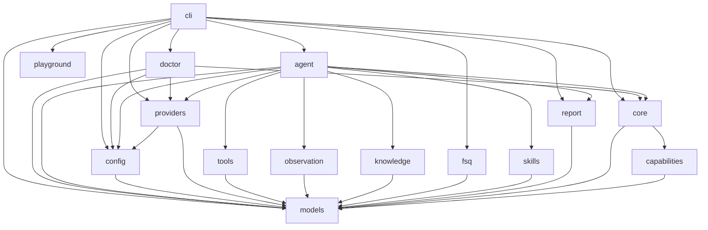

# fsq-agent Project Specification

This repository uses spec-driven development. Root `SPEC.md` is the project-level specification and module navigation source of truth. Each module also owns a module-level `SPEC.md`.

## SPEC Ownership And SDD Contract

Root `SPEC.md` and module `SPEC.md` files are the current factual baseline for implementation. They describe present behavior, public contracts, module ownership, dependency direction, configuration surface, error semantics, architecture level, and implementation invariants.

Spec-driven development uses design documents as inputs to produce confirmed SPEC deltas. Non-trivial development must update the relevant current-fact specs and receive confirmation before implementation. If implementation reveals that a spec is missing or wrong, implementation stops until the relevant spec is updated and confirmed. Bug fixes that do not change public interfaces or intended behavior may skip design-document creation, but must still read relevant specs and verify that they remain accurate.

SPEC files must not carry design-process narrative, migration history, discarded alternatives, future roadmap, planned signatures, removed behavior that code no longer supports, or detailed test matrices. Current compatibility behavior and current rejection behavior may be specified, but must be written as present-tense facts.

## Tool And Capability Execution

fsq-agent separates dynamic-only helper tools from recordable execution capabilities.

- AgentTools are OpenAI Agents SDK helper tools used only during dynamic execution. They include scoped file reads/writes and bounded run-artifact search/slice helpers. AgentTools are not strict replay capabilities, are not registered in FSQ capability registries, and are never recorded into generated strict YAML.
- CommonTools are recordable platform-default execution capabilities inherited by every active platform. The active CommonTool is `wait_ms`/`waitMs`. Runtime-secret credential input is represented on text-entry PlatformTools with `textType: runtimeSecret` and is resolved by execution core before driver invocation, not by an LLM-facing secret-fetch tool.
- PlatformTools are recordable active-platform capabilities. They include concrete backend driver actions, including backend-owned assertions such as `assert_with_ai`.

All recordable execution behavior is declared through decorator-driven capability metadata. The neutral `capabilities` module owns shared declaration decorators, catalog-backed platform validation, and reflection/discovery helpers that produce `models.CapabilityDefinition` records for CommonTools and PlatformTools. The capability registry is the source of truth for canonical names, replay aliases from `ReplayPolicy(kind="fsq_command")`, parameter schemas, tool family, replay policy, sensitivity, step kind, platform/backend ownership, and provenance. Live capability executor kinds are `common` for inherited CommonTools and `driver` for driver-backed PlatformTools; `harness` is not a live capability executor kind. Capability metadata does not own per-tool SDK schema strictness or default screenshot capture policy; active SDK capability tools use strict JSON schema by default. Methods that are unfinished or should not be exposed to the LLM must not be decorated as active capabilities.

Decorator unification is a declaration-layer concern, not an AgentTool merge. AgentTools remain dynamic-only helper behavior owned by `tools`; CommonTool and PlatformTool capabilities are owned by `core`. CommonTool bodies live in platform tool providers, while backend-specific PlatformTool bodies live on concrete backend drivers. Concrete harness classes such as `AndroidHarness` and `WebHarness` remain runner-facing runtime gateways and services, but they must not own individual tool bodies such as `assert_with_ai`.

`StepRunner` is the common execution manager for CommonTool and PlatformTool capabilities. It looks up the capability registry, validates params, resolves runtime-secret text input references, applies step-kind evidence capture, post-action delay, and sensitivity policy, emits structured safe events, and invokes recordable capabilities through `HarnessInterface.invoke_action(step, context)`. Harness implementations route CommonTools to inherited platform tool providers and driver-backed PlatformTools to concrete backend drivers while supplying runtime services such as context, artifact capture, evaluator injection, driver access, settings, and error classification. Default automatic evidence capture is derived from the resolved capability plus `ExecutableStep.kind`, not executor kind: `action` captures before and after, `assertion` captures before only, `setup` captures after only, and `teardown` captures before only; observation and diagnostic steps do not receive automatic screenshot capture. CommonTool action steps such as `wait_ms` receive the same automatic capture policy as PlatformTool action steps. Every automatic capture records the platform-neutral pair `screenshot` plus `ui_snapshot`. Existing explicit observation command aliases such as Android `uiTree`, Web `pageSnapshot`, and desktop `uiSnapshot` remain valid authored capabilities and replay aliases, but they do not control automatic capture artifact naming. For every capability, the effective post-action delay resolves from `CapabilityDefinition.post_action_delay_seconds` when set, otherwise from configured `execution.post_action_delay_seconds` defaults for CommonTool or PlatformTool capabilities. A positive delay is execution timing only, occurs after invoke and before finalize/after-action evidence capture, and must not create synthetic `waitMs` commands, evidence steps, replay commands, or action results. Executable paths must not branch on names such as `waitMs`, `wait_ms`, Android command names, Web command names, or desktop command names.

Capability registry bootstrap is platform-selected. Entry layers register the active platform's inherited CommonTool capabilities plus only the configured platform's PlatformTool capability set. Android and Web PlatformTools must not be registered together in the default runtime registry, so each platform can expose native canonical names and `fsq_command` replay aliases without cross-platform ambiguity. AgentTools are exposed only to dynamic SDK agents and are excluded from strict replay registries.

## Recorded Strict Case Artifacts

Dynamic LLM runs may optionally record the actual successful replayable execution trace as a generated strict FSQ `.codex.yaml` artifact under the run output directory. Recording is a CLI-owned post-run behavior: the agent runtime persists normalized capability events, while the CLI recorder converts replayable non-observation capability results into a strict candidate case according to `ReplayPolicy` metadata. Observation capabilities such as Android `uiTree`/canonical `ui_snapshot`, Web `pageSnapshot`/`page_snapshot`, desktop `uiSnapshot`/`ui_snapshot`, and screenshot/snapshot tools may remain callable in dynamic execution and authored strict cases, but dynamic recording must not emit them as generated strict YAML commands. By-design observation skips remain available in the recording manifest audit data and must not be emitted as generated case warning metadata. Generated cases must never mutate source cases or `cases.dir`, and runtime secret values must never be written to YAML, manifests, events, or reports. Runtime-secret text inputs are recorded by environment variable name using `textType: runtimeSecret`.

Recorded strict cases may contain runtime-secret text input references using `textType: runtimeSecret` and `waitMs` replay aliases. Strict execution bootstraps the active platform capability registry before YAML parsing, treats missing `textType` on text-entry commands as literal text for case compatibility, resolves runtime-secret text values in memory before external text-entry actions begin, and resolves `waitMs` through the registry to the inherited `wait_ms` CommonTool capability.

Recorded Web lifecycle commands are ordinary replayable capability results when the dynamic run actually executed `startBrowser` or `closeBrowser`. The recorder must not invent browser lifecycle commands as cleanup or setup guesses.

Strict FSQ case metadata may declare optional case lifecycle hooks in the first YAML document through `onCaseStart` and `onCaseComplete`. Platform config YAML may also declare reusable strict lifecycle hooks through top-level `caseLifecycle.onCaseStart` and `caseLifecycle.onCaseComplete`. Each lifecycle field is independently optional and may contain either one hook entry mapping or an ordered list of hook entry mappings. Within one hook entry, `runCase` and `runShell` are independently optional supported actions; an entry must contain at least one supported action, may contain both, and when both are present strict execution must preserve the authored YAML key order. `runCase` executes another `.codex.yaml` case using the same strict relative path resolution policy as `--case-yaml` inputs, and recursive hook chains fail before infinite execution. `runShell` executes an operator-authored local shell command string without platform-specific command validation. Strict execution runs config `onCaseStart` hooks, case `onCaseStart` hooks, the main case commands only when before hooks pass, case `onCaseComplete` hooks, then config `onCaseComplete` hooks. Any config hook, case hook, main command, or shell hook failure fails the overall strict case. Config or case before-hook failure skips later before hooks and the main command body as appropriate, but does not skip after hooks. Dynamic LLM raw-case execution continues to treat YAML as planning input text and does not execute lifecycle hooks.

## Dynamic LLM Pre-Plan and Goal Verification

Dynamic LLM `--goal`, `--case-yaml`, and `--case-dir` runs use pre-plan as the input-understanding boundary before external UI actions begin. The pre-planner receives a concise active CommonTool/PlatformTool capability summary generated from the active platform registry so planning can align with the actual executable action surface without duplicating tool tables in skills. The pre-planner must produce structured ordered `key_actions` for the main execution loop and one `verification_goal` string for final evidence-based verification. Dynamic final verification is goal-only and has no user-configurable `verification.mode`.

Dynamic LLM `--case-yaml` and `--case-dir` runs read authored case files as raw UTF-8 reference text, not as strict executable steps. The CLI-owned dynamic task construction must preserve that full raw reference in explicit planning-reference fields. Raw YAML steps are advisory only for dynamic LLM execution: they may help infer an execution flow, but they are not assumed accurate and must not be transformed into local executable steps or final verifier requirements. For raw cases, pre-plan should prefer case-level intent signals such as name, metadata, tags, properties, and human-authored goal text when summarizing `verification_goal`; step content may provide supporting context when the case-level intent is incomplete or ambiguous. Dynamic recording continues to reconstruct replayable commands only from actual run events.

## Runtime Configuration Defaults

Default local LLM runs use GitHub Copilot provider authentication with Copilot model `gpt-5.5` and tracing enabled. Provider selection is local environment-owned through `FSQ_LLM_PROVIDER=github_copilot|azure_openai`; when that variable is absent, GitHub Copilot remains the default. Azure OpenAI endpoint, deployment/model, and API key values come from fixed environment variable names rather than YAML fields. Repository-owned platform YAML presets are committed as `config.android.yaml`, `config.web.yaml`, `config.windows.yaml`, and `config.macos.yaml`; `config.example.yaml` is a reference-only sample and not a runtime preset. Each platform preset owns stable, shareable platform policy and defaults such as tracing default, OpenAI Agents SDK turn limit, harness platform/backend, non-sensitive browser/base URL policy, execution post-action delay defaults, strict `caseLifecycle` hook policy, runtime secret allowlist names, agent context knowledge-root resources, workspace root, cases root, and output root. The committed presets set `openai_agents.max_turns` explicitly: Android and Windows default to 100 turns, while Web and macOS default to 50 turns. Local user values that must be set by an operator, vary per machine, contain secrets, or point to local runtime targets belong in process environment or `.env`; examples include LLM provider selection, Android app id, Android device serial, Web browser executable path, Windows application executable path, Windows pywinauto adapter mode, Windows launched-window title matcher, Windows default launch arguments, macOS Appium server URL, macOS bundle id or app path, account secrets, and Azure provider values.

The local setup entry is `fsq-agent init --platform android|web|windows|macos [--provider github_copilot|azure_openai]`. It initializes or verifies the current working directory `.fsq-agent-workspace` workspace for the selected platform, and when `--provider` is supplied it may update the current working directory `.env` file and perform provider-local readiness. Copilot setup may run device-code authentication with explicit OAuth scopes sufficient for Copilot token exchange when no valid cached GitHub OAuth token exists, then exchange and cache the short-lived Copilot provider token under the fsq-agent workspace. Initialization and provider setup must not send live model verification requests. When `--provider` is omitted, `init` must not mutate provider settings or start provider authentication. Runtime Copilot provider construction for pre-plan, dynamic execution, verification, and provider-backed AI assertion first reads the cached Copilot provider token produced by `init`; when that short-lived provider token is missing or expired, runtime construction may use a valid cached GitHub OAuth token to silently exchange and cache a fresh provider token, but it must not start device-code authentication. If neither a valid provider token nor a valid GitHub OAuth token exists, runtime construction fails with a setup-required configuration error.

The local diagnostic entry is `fsq-agent doctor [--platform android|web|windows|macos] [--format text|json] [--color auto|always|never] [--non-interactive] [--repair]`. It performs bounded environment, workspace, provider, and selected-platform connectivity checks without model inference, target-workflow execution, target application launch, or Appium session creation. Every valid diagnosis runs the complete check set and reports one overall result derived from final verified checks: any failed check blocks the diagnosis, while warnings and skips alone do not. Interactive text diagnosis handles an actionable issue before continuing to dependent work: it presents `ACTION REQUIRED` instead of a premature final severity, asks whether to apply the allowlisted repair, immediately verifies an applied repair, and then publishes only the verified `PASS`, original/verified `WARN`, or original/verified `FAIL`. Declined, skipped, failed, or unresolved repairs preserve the check severity. Non-interactive diagnosis publishes final states directly; `--repair` immediately applies and verifies eligible no-input repairs while skipping input-required repairs. Human-readable text gives every concrete check one bracketed section title derived deterministically from its stable check id, such as `[Appium status]`, and places Check, Action, Repair, Verify, Result, Fix, Run, and Backup lines beneath that title. Phase events do not create duplicate visible phase headings. TTY output replaces transient running/action lines within the active check section, while plain output is append-only and uses the same section hierarchy. Final text contains `Summary: PASS|FAIL|ERROR|CANCELLED` followed by aggregate check counts and has no target-readiness or impact section. Status words remain visible and may use terminal-aware colors; JSON remains one stable diagnosis-only document with no display titles, repair side effects, transient action-required data, progress text, ANSI escapes, diagnostic-mode field, target-readiness data, or affected-target data. Doctor safe repair is a closed allowlist: missing workspace initialization, marker creation only for an empty workspace, validated non-secret platform `.env` values entered interactively with atomic backup-preserving updates, and Copilot provider-token refresh from an already valid cached GitHub OAuth token. Doctor never installs dependencies, requests secrets, starts provider device-code authentication, rewrites presets, controls ADB/Appium services, or removes non-empty directories.

## Platform Blocks

Shared platform rules:

- `harness.platform` selects exactly one active platform for normal dynamic, strict, and playground execution.
- Public CLI entry points select the active platform with `--platform android|web|windows|macos` where platform context is needed; config loading maps that platform id to the corresponding repository-owned `config.<platform>.yaml` preset before validation. Public CLI commands do not expose workspace selection and use the current working directory `.fsq-agent-workspace` as the managed workspace. Optional provider setup is part of `init --provider`, not a separate platform-neutral command.
- Entry layers build a platform-selected capability registry: inherited CommonTool capabilities plus only the active platform's PlatformTool capabilities.
- `StepRunner`, `StepSequenceRunner`, evidence, recording, report generation, and FSQ parsing stay platform-neutral and consume capability metadata rather than platform action-name branches.
- Repository-owned platform YAML presets own stable platform defaults and policy; environment variables own provider selection, required operator-provided values, local paths, local server URLs, target identifiers, credentials, and other machine-specific values. Current compatibility inputs for older YAML-owned local paths must be explicit in module SPECs, and examples use the env-owned shape.
- Platform-specific behavior belongs in platform parameter models, action catalogs, harnesses, drivers, config blocks, and configured skill Markdown.

Android platform block:

- Platform id: `android`.
- Backend: `uiautomator2`.
- Local app/device values come from `FSQ_ANDROID_APP_ID` and `FSQ_ANDROID_SERIAL` or strict FSQ case metadata where allowed.
- Doctor treats successful ADB execution as the Android tooling-readiness boundary. Device discovery retries one bounded time when the first `adb devices` attempt times out or fails while the daemon is starting, preventing a successful daemon startup from being reported as an ADB failure. `adb devices` command/server failure after retry blocks Android readiness, while a successful empty device list is a warning and skips device-dependent uiautomator2/package checks without blocking readiness. Offline, unauthorized, configured-serial mismatch, and ambiguous multiple-device selection remain blocking failures because a target is present/configured but unusable or unresolved.
- Explicit observation capability: canonical `ui_snapshot` with Android alias `uiTree`. Automatic runner evidence captures `screenshot` plus normalized `ui_snapshot` using compact Android UI hierarchy XML content. Android compact UI snapshots keep the existing `{"xml": ...}` payload shape, may use source-level hierarchy compression when available, remove layout-only/default data, clip long text-like attributes to the first 50 characters, and fall back to raw hierarchy XML if compaction is unavailable or unsafe.
- Harness skill: `android-harness.md`.

Web platform block:

- Platform id: `web`.
- Backend: `playwright`.
- Runtime settings include browser channel, environment-backed browser executable path, headless mode, optional base URL, and optional viewport fields when specified by module specs.
- Browser lifecycle is explicit through `start_browser`/`startBrowser` and `close_browser`/`closeBrowser`. Runtime, CLI, FSQ parsing, StepRunner, StepSequenceRunner, and playground entry paths must not auto-inject lifecycle commands or launch a browser as a driver-construction side effect.
- `startBrowser` is idempotent and reuses the active browser/page when one is already started. `closeBrowser` is idempotent, closes the active browser/page when present, resets driver-owned state, and permits a later `startBrowser` in the same task.
- Web page-dependent actions, including `navigateTo`, require an active browser/page and must fail clearly when invoked before `startBrowser`; `navigateTo` must not implicitly start the browser.
- Explicit observation capability: `page_snapshot` with alias `pageSnapshot`; Web must not expose Android `ui_tree`/`uiTree` naming. Automatic runner evidence captures `screenshot` plus normalized `ui_snapshot` using Web page/accessibility snapshot content.
- Current action surface follows Playwright MCP core automation semantics: snapshot-first targets, semantic actions, screenshots as observation/evidence, and no unsafe/opt-in capability families.
- Harness skill: `web-harness.md`.

Windows platform block:

- Platform id: `windows`.
- Backend: `pywinauto`.
- Operator-local values come from environment variables: `FSQ_WINDOWS_APP_PATH`, `FSQ_WINDOWS_BACKEND_KIND`, `FSQ_WINDOWS_WINDOW_TITLE_RE`, and `FSQ_WINDOWS_LAUNCH_ARGS`. YAML owns only stable Windows platform/backend selection. `FSQ_WINDOWS_BACKEND_KIND` selects pywinauto's UI automation mode (`uia` by default, or `win32`) and is not a second FSQ Windows backend.
- Windows action surface exposes desktop aliases through the existing PlatformTool registry: `launchApp`, `killApp`, `clickOn`, `doubleClickOn`, `rightClickOn`, `typeText`, `pressKey`, `hoverOn`, `scrollOn`, `dragTo`, `assertVisible`, `uiSnapshot`, and `assertWithAI`.
- Explicit observation capability: `ui_snapshot` with alias `uiSnapshot`; Windows must not expose Android `ui_tree`/`uiTree` or Web `page_snapshot`/`pageSnapshot` naming. Automatic runner evidence captures `screenshot` plus normalized `ui_snapshot`.
- Harness skill: `windows-harness.md`.

macOS platform block:

- Platform id: `macos`.
- Backend: `appium_mac2`.
- Runtime maps FSQ names internally to Appium native `platformName: Mac` and `automationName: Mac2`.
- Operator-local values come from environment variables: `FSQ_MACOS_APPIUM_SERVER_URL`, `FSQ_MACOS_BUNDLE_ID`, and `FSQ_MACOS_APP_PATH`. YAML owns stable macOS defaults such as backend selection, page-source simplification depth, and action timeout seconds.
- Current action surface exposes desktop aliases through the existing PlatformTool registry: `launchApp`, `killApp`, `clickOn`, `doubleClickOn`, `rightClickOn`, `typeText`, `pressKey`, `hoverOn`, `dragTo`, `takeScreenshot`, `uiSnapshot`, `assertVisible`, `assertElementsOrder`, and `assertWithAI`.
- Explicit observation capability: `ui_snapshot` with alias `uiSnapshot`; macOS must not expose Android `ui_tree`/`uiTree` or Web `page_snapshot`/`pageSnapshot` naming. Automatic runner evidence captures `screenshot` plus normalized `ui_snapshot`.
- Harness skill: `macos-harness.md`.
- The Appium MCP reference project may guide Mac2 session mechanics and action semantics, but fsq-agent must not wrap or depend on that MCP server as a runtime capability source.

## Prompt Context Boundaries

Dynamic LLM prompt context has four distinct channels. `agent_instructions.j2` owns stable dynamic execution rules. `task_input.j2` owns one task's structured input, ordered key actions, and final `verification_goal`. `knowledge/project.md` owns tested-project-specific guidance loaded for normal dynamic execution. Configured skills under the knowledge root own composable execution guidance such as platform and harness rules. There is no separate custom-instruction configuration channel; ad hoc operator guidance must be represented as project knowledge or configured skills.

Loader diagnostics such as missing optional skills or missing optional knowledge references are operational signals and must not be rendered into model-facing prompts. Required skill failures remain fail-fast. Optional broken skills are skipped with operator-visible diagnostics and are not passed to the LLM as warning-only or partial guidance. Runtime Markdown knowledge and skill content should stay concise, current, and aligned with exposed AgentTool, CommonTool, and PlatformTool surfaces.

## Module Table

| Module | SPEC | Purpose |
|---|---|---|
| models | fsq_agent/models/SPEC.md | Owns shared domain models, FSQ case and lifecycle hook metadata/settings models, capability metadata/registry contracts, invocation/result contracts, replay reference models, and exceptions. |
| capabilities | fsq_agent/capabilities/SPEC.md | Owns neutral capability declaration decorators, catalog-backed platform action validation, and metadata discovery helpers used by `core` recordable capabilities. |
| config | fsq_agent/config/SPEC.md | Loads and validates env/YAML runtime configuration and owns side-effect-free doctor inspection plus atomic `.env` and constrained workspace mutation primitives. |
| providers | fsq_agent/providers/SPEC.md | Builds Azure OpenAI/GitHub Copilot sessions and evaluators and owns bounded no-inference provider diagnostics plus explicit cached-token refresh. |
| doctor | fsq_agent/doctor/SPEC.md | Orchestrates TTY-aware complete diagnosis, one overall result, typed text/JSON reports, and the closed safe-repair allowlist across config, providers, and platform probes. |
| tools | fsq_agent/tools/SPEC.md | Provides dynamic-only AgentTool providers, scoped file helpers, bounded artifact lookup helpers, and the OpenAI Agents SDK AgentTool adapter. |
| observation | fsq_agent/observation/SPEC.md | Persists run event timelines; screenshots, UI trees, and other observations are represented by platform evidence artifacts or AgentTool artifact refs. |
| knowledge | fsq_agent/knowledge/SPEC.md | Loads project-specific application knowledge and task-referenced knowledge assets. |
| fsq | fsq_agent/fsq/SPEC.md | Loads FSQ AI Test DSL YAML cases, validates case lifecycle hook metadata, resolves authored action aliases through the capability registry, validates replay references, and converts parsed command documents into canonical deterministic executable steps. |
| skills | fsq_agent/skills/SPEC.md | Loads complete configured automation skill instruction bundles and skips or fails broken bundles according to requiredness. |
| report | fsq_agent/report/SPEC.md | Generates LLM task reports, strict-core evidence reports, reconstructs tool calls from structured capability metadata, and resolves stored reports by run id. |
| core | fsq_agent/core/SPEC.md | Defines shared execution management, platform harness/driver factories and interfaces, evidence coordination, private backends, and the platform diagnostic probe factory. |
| agent | fsq_agent/agent/SPEC.md | Orchestrates dynamic goal/reference execution through OpenAI Agents SDK, AgentTool exposure, active-platform capability exposure, verification, replayable event metadata, and report generation. |
| playground | fsq_agent/playground/SPEC.md | Serves the local browser playground for active-platform runtime status, Android session setup where applicable, dynamic goal/raw-case execution, strict YAML execution, loading existing run results, screenshots, replay video preview, and report lookup. |
| cli | fsq_agent/cli/SPEC.md | Exposes the public `init`, `doctor`, `run`, `report`, `playground`, optional provider setup during initialization, capability registry bootstrap, strict replay including case lifecycle hook orchestration, dynamic-run recording, and local playground workflows. |

## Frontend Build Boundary

- The repository root npm project owns browser-source dependency resolution and Vite compilation for repository web pages. It uses one lock file and a multi-page Vite configuration so independently owned page entries build to distinct output paths.
- Authored Playground browser source lives under `frontend/playground`. The Python `playground` module owns the corresponding HTTP behavior and production static serving but does not own authored JavaScript, CSS, or HTML source.
- `ts-ebml` is an exact npm dependency consumed through an ES module import. Third-party browser bundles and Vite-generated assets are not tracked in Git.
- Vite-generated Playground assets live under `fsq_agent/playground/static` and are included in the Python wheel. Release builds run the npm build before Python wheel construction. A prebuilt wheel is self-contained and does not require Node.js or network access at runtime.
- Frontend development may use the Vite development server with API and streaming requests proxied to the Python Playground server. Production and installed-wheel usage serve generated assets and APIs from the single Python Playground process.

## Architecture Diagram

## Development Rules

- Each module exposes public symbols only from `__init__.py` using explicit `__all__`.
- Frontend dependency changes update the root npm manifest and lock file. Generated frontend assets and `node_modules` remain untracked; source-checkout production startup requires a successful frontend build, while installed wheels contain the generated assets.
- Public API boundary optimization is incremental. When a module SPEC adopts the stricter boundary, public exports should be limited to interfaces/protocols, abstract classes, stable service classes that are themselves the public contract, and approved factory classes. Concrete implementation-selection classes such as platform harnesses, platform backends, and provider adapters should sit behind public protocols/factories unless the module SPEC records a named exception with allowed importers, rationale, and revisit condition. Function-style helpers, decorators, and discovery utilities require the same SPEC-visible exception policy.
- Internal implementation files are prefixed with `_`.
- Shared data structures and exceptions live only in the `models` module. Capability declaration decorators, catalog-backed platform validation, and decorated-method discovery live only in the `capabilities` module.
- Module imports must follow the DAG in the architecture diagram.
- Package-private composition helpers at the `fsq_agent` package root may compose public module APIs for shared entry-layer bootstrap and dynamic-run recording used by CLI and Playground. They must remain private, must not expose public module contracts, and must not be imported by `models`, `capabilities`, `tools`, `fsq`, `core`, `providers`, or `report`.
- `capabilities` may import `models` only among project modules. It must not import `tools`, `core`, `agent`, `cli`, `fsq`, `providers`, `report`, `playground`, SDK objects, concrete drivers, or backend runtime types.
- Provider construction lives in `providers`; `core` must use provider-neutral protocols and must not import provider/runtime modules.
- Dynamic-only local helper utilities live as AgentTools in `tools`; recordable CommonTool and PlatformTool capabilities live in `core`, with CommonTool bodies in platform tool providers and backend PlatformTool bodies on concrete drivers. CommonTools and PlatformTools declare executable metadata through `capabilities`. All recordable capabilities must be registered before strict YAML parsing or SDK capability exposure, and platform registries must contain only inherited CommonTools plus the active platform's PlatformTools. AgentTools must not be registered for strict replay.
- Replay, sensitivity, evidence, and tool-origin behavior must come from capability metadata and normalized `StepRunner` results, not hard-coded tool-name sets.
- Public interface changes require `SPEC.md` update and user confirmation before implementation.
- New platforms or capability groups require current-fact SPEC updates before implementation and must reuse shared capability declaration/registry contracts unless the confirmed SPEC changes the shared contract.
- SPEC content must remain a current factual baseline. Design rationale, historical narrative, future roadmap, implementation plan, and detailed test matrices belong in design docs, reference docs, or tests rather than root or module SPEC files.
- `CLAUDE.md` and `AGENTS.md` are agent entry points only. They must point to this root `SPEC.md` and must not duplicate project specification content.

## Python Architecture Rules

- Use the lowest architecture level that keeps the module clear, testable, and changeable.
- `models`, `capabilities`, `tools`, `fsq`, `report`, `knowledge`, `skills`, `config`, `providers`, and `observation` default to Level 2 Simple Package unless a module SPEC records a stronger need.
- `core`, `agent`, `cli`, `doctor`, and `playground` use Level 3 Layered Application because they coordinate execution flows, external SDKs, harnesses, providers, diagnostics, persistence, HTTP entry points, and user entry points.
- Public APIs must be exported from module `__init__.py` files, and internal implementation modules must remain private across module boundaries. Modules that have adopted the stricter public API boundary must not export concrete implementation-selection classes, helper functions, decorators, or discovery utilities unless their module SPEC records an explicit exception. Public factories should own construction/selection of private implementations when a caller only needs a protocol or service contract.
- Do not introduce Repository, Unit of Work, Clean Architecture, or DDD patterns unless a confirmed SPEC records the concrete reason.
