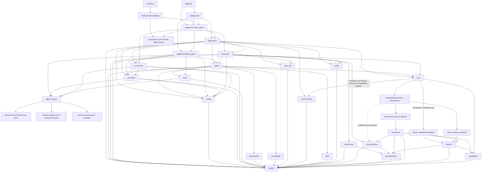

# fsq-agent Project Specification

Root `SPEC.md` is the project-level specification and module navigation source of truth. Each module also owns a module-level `SPEC.md`.

## Project Specification Ownership

Root `SPEC.md` and module `SPEC.md` files are the current factual baseline for implementation. They describe present behavior, public contracts, module ownership, dependency direction, configuration surface, error semantics, architecture level, and implementation invariants.

## Tool And Capability Execution

fsq-agent separates dynamic-only helper tools from recordable execution capabilities.

- AgentTools are SDK-neutral helper tools used only during dynamic execution through `agent_engine`. They include scoped file reads/writes and bounded run-artifact search/slice helpers. AgentTools are not strict replay capabilities, are not registered in FSQ capability registries, and are never recorded into generated strict YAML.
- CommonTools are recordable platform-default execution capabilities inherited by every active platform. The active CommonTool is `wait_ms`/`waitMs`. Runtime-secret credential input is represented on text-entry PlatformTools with `textType: runtimeSecret` and is resolved by execution core before driver invocation, not by an LLM-facing secret-fetch tool.
- PlatformTools are recordable active-platform capabilities. They include concrete backend driver actions, including backend-owned assertions such as `assert_with_ai`.

All recordable execution behavior is declared through decorator-driven capability metadata. The neutral `capabilities` module owns shared declaration decorators, catalog-backed platform validation, and reflection/discovery helpers that produce `models.CapabilityDefinition` records for CommonTools and PlatformTools. The capability registry is the source of truth for canonical names, replay aliases from `ReplayPolicy(kind="fsq_command")`, parameter schemas, tool family, replay policy, sensitivity, step kind, platform/backend ownership, and provenance. LLM-facing CommonTool and PlatformTool parameter schemas are generated from shared Pydantic parameter models and include concise field descriptions plus model-level guidance for cross-field argument rules such as target-or-locator and runtime-secret text-entry contracts. Live capability executor kinds are `common` for inherited CommonTools and `driver` for driver-backed PlatformTools; `harness` is not a live capability executor kind. Capability metadata does not own per-tool engine schema strictness or default screenshot capture policy; active engine capability tools use strict JSON schema by default. Methods that are unfinished or should not be exposed to the LLM must not be decorated as active capabilities.

Decorator unification is a declaration-layer concern, not an AgentTool merge. AgentTools remain dynamic-only helper behavior owned by `tools`; CommonTool and PlatformTool capabilities are owned by `core`. CommonTool bodies live in platform tool providers, while backend-specific PlatformTool bodies live on concrete backend drivers. Concrete harness classes such as `AndroidHarness` and `WebHarness` remain runner-facing runtime gateways and services, but they must not own individual tool bodies such as `assert_with_ai`.

`StepRunner` is the common execution manager for CommonTool and PlatformTool capabilities. It looks up the capability registry, validates params, resolves runtime-secret text input references, applies step-kind evidence capture, post-action delay, and sensitivity policy, emits structured safe events, and invokes recordable capabilities through `HarnessInterface.invoke_action(step, context)`. Harness implementations route CommonTools to inherited platform tool providers and driver-backed PlatformTools to concrete backend drivers while supplying runtime services such as context, artifact capture, evaluator injection, driver access, settings, and error classification. Default automatic evidence capture is derived from the resolved capability plus `ExecutableStep.kind`, not executor kind: `action` captures before and after, `assertion` captures before only, `setup` captures after only, and `teardown` captures before only; observation and diagnostic steps do not receive automatic screenshot capture. CommonTool action steps such as `wait_ms` receive the same automatic capture policy as PlatformTool action steps. Every automatic capture records the platform-neutral pair `screenshot` plus `ui_snapshot`. Existing explicit observation command aliases such as Android `uiTree` and Web/desktop `uiSnapshot` remain valid authored capabilities and replay aliases, but they do not control automatic capture artifact naming. For every capability, the effective post-action delay resolves from `CapabilityDefinition.post_action_delay_seconds` when set, otherwise from configured `execution.post_action_delay_seconds` defaults for CommonTool or PlatformTool capabilities. A positive delay is execution timing only, occurs after invoke and before finalize/after-action evidence capture, and must not create synthetic `waitMs` commands, evidence steps, replay commands, or action results. Executable paths must not branch on names such as `waitMs`, `wait_ms`, Android command names, Web command names, or desktop command names.

Capability registry bootstrap is platform-selected. Entry layers register the active platform's inherited CommonTool capabilities plus only the configured platform's PlatformTool capability set. Android and Web PlatformTools must not be registered together in the default runtime registry, so each platform can expose native canonical names and `fsq_command` replay aliases without cross-platform ambiguity. AgentTools are exposed only to dynamic agents through `agent_engine` and are excluded from strict replay registries.

## Case Creation And Testing

The public Case workflows are `fsq case create`, `fsq case test`, and static `fsq case format`. Case creation accepts a natural-language Goal, uses AI during real testing, and may write a Run-local candidate `*.fsq.yaml`. Case testing accepts an existing `*.fsq.yaml`, executes it exactly once through the deterministic path, and preserves the source file. With `--suggest`, a separate post-execution AI analysis may produce Run-local suggestions and a candidate Case from the parsed source and persisted execution facts; that analysis has no UI-action capabilities and cannot change the completed execution result. Without `--suggest`, testing performs no AI-driven Case analysis or modification. Adapters invoke these workflows through the shared Application package.

`*.fsq.yaml` is canonical. `*.codex.yaml` may be accepted for one deprecation cycle with a structured warning. `*.intent.yaml` and `fsq.test-intent/v1` are unsupported. Top-level public execution commands named `test`, `replay`, or `run` are not part of the target CLI.

## Recorded Case Artifacts

AI-participating Case operations may record a replayable trace as a Run-local candidate `*.fsq.yaml`. The agent persists normalized capability events and Execution coordinates conversion of replayable non-observation results according to `ReplayPolicy` metadata. Generated Goal Cases use a stable Case name and normalized Goal description, identically for valid and draft recordings. Explicit Case names take precedence; otherwise Execution derives a deterministic name from platform and normalized Goal. Run provenance, recording status, draft state, and warnings belong to Run-local recording metadata rather than generated Case YAML. Generated Cases never mutate source Cases, and secrets are never persisted. CLI Goal-based Case creation publishes validated recordings under the stable name, while Control Plane Explore keeps the recording Run-local until explicit save under a chosen name. Publication and save reuse identical destination bytes without writing and reject differing existing contents without replacement; the Run-local candidate remains available. Suggestion-enabled existing-Case testing never publishes into `cases.dir`.

Recorded strict cases may contain runtime-secret text input references using `textType: runtimeSecret` and `waitMs` replay aliases. Strict execution bootstraps the active platform capability registry before YAML parsing, treats missing `textType` on text-entry commands as literal text for case compatibility, resolves runtime-secret text values in memory before external text-entry actions begin, and resolves `waitMs` through the registry to the inherited `wait_ms` CommonTool capability.

Recorded Web lifecycle commands are ordinary replayable capability results when the dynamic run actually executed `startBrowser` or `closeBrowser`. The recorder must not invent browser lifecycle commands as cleanup or setup guesses.

For Goal-based Case creation, completion of the Dynamic Agent main execution appends one `dynamic_agent_token_usage` event to the Run-local `events.jsonl` when neutral engine usage measurements are available. The event reports only the selected backend's measured aggregated usage for that main execution and excludes pre-plan, final verification, AI assertions, suggestions, readiness, authentication, and metadata requests. Token counts are never estimated, and this usage event does not change `run.json`.

FSQ Case metadata may declare optional deterministic lifecycle hooks through `onCaseStart` and `onCaseComplete`; platform config may declare reusable hooks through `caseLifecycle`. `runCase` executes another `*.fsq.yaml` using the same contained Case path policy, and recursive chains fail before infinite execution. Application coordinates lifecycle execution through FSQ and Core authorities; adapters do not own lifecycle semantics.

## Deterministic Case Formatting

`case_dsl` owns shared static validation, model-aware normalization, and deterministic YAML serialization used directly by Case recording, suggestion candidates, saved recordings, and Application formatting. CLI is a transport entry to the same Python contracts, never an internal subprocess dependency. Equal stable metadata, configuration, ordered actions, and effective parameters produce byte-identical Cases; genuine behavioral differences remain visible. Ordinary formatting preserves existing identity and user metadata and does not perform historical migration.

`fsq case format PATH [--check | --diff | --write] [--json]` is non-interactive and defaults to read-only checking. It validates before formatting or writing, needs no registered Workspace or Provider, and never executes actions or resolves credentials. Static validation checks only the named Case and hook syntax; cross-file lifecycle and runtime preflight remain execution responsibilities. Application owns file orchestration; Case DSL owns content rules; adapters own output and exit mapping.

## Dynamic LLM Pre-Plan and Goal Verification

Goal-based Case creation uses pre-plan as the input-understanding boundary before external UI actions begin. The pre-planner receives complete configured skills that load successfully, optional project/page knowledge, and the active capability summary. It produces ordered `key_actions` and one `verification_goal` before external UI actions.

Existing-Case testing parses the Case through FSQ rather than treating YAML as untyped planning text. Suggestion-enabled testing first completes the same single deterministic execution as ordinary Case testing, then gives the parsed Case and bounded persisted execution facts to a read-only AI analysis that cannot invoke Harness, Driver, Core capabilities, or other UI actions. The analysis preserves the authoritative execution status and facts, keeps source steps immutable, and writes suggestions and any candidate Case only inside that Run directory.

`DynamicExecutionService` owns dynamic Run allocation, source snapshots, authoritative evidence context, frozen execution conclusions, derived processing, and metadata transitions. It supplies a Models-owned `RunExecutionContext` and shared evidence sink to `FsqAgent.run_in_context`; Agent performs planning, execution, verification, and business event emission through neutral runtimes and returns `DynamicAgentOutcome` without importing Execution, allocating/updating Run metadata, or generating reports. Execution freezes execution and verification facts before report generation and optional recording, then finalizes processing and cancellation/error paths without creating another Run. Processing failures cannot overwrite the frozen execution conclusion.

## Model And Agent Boundary

`agent_engine` owns independently reusable model/provider/agent-execution protocols and neutral input, output, tool, event, filter, and error contracts. Its private backends use the pinned OpenAI Python client for Responses requests and the pinned Google GenAI Python client for Gemini Developer API Interactions requests. Concrete backend objects, vendor message shapes, third-party exceptions, and concrete constructor injection do not cross into FSQ business code.

All six inference paths use this boundary for OpenAI, Azure OpenAI, Google Gemini, and GitHub Copilot: pre-plan, main execution, and verification call `AgentEngine.run`; visual assertions, connection testing, and Case suggestions call tool-free `Model.complete`. A sole local tool dispatcher and continuation loop is shared across backends; each private backend owns round trips, protocol conversion, and opaque history, not another execution loop. Model-paired engine selection remains inside `agent_engine`. Direct requests do not enter the agent loop, and the loop does not call public tool-free `Model.complete` or add semantic retries.

Both neutral request types carry validated `reasoning_effort` with values `low`, `mid`, or `high` and an omitted-field default of `mid`. Every backend request, including continuation, explicitly sends the mapped native effort. Coding Agent and AI Services forward the resolved platform effort across the five business paths; connection testing independently requests `low`. Agent Engine owns private numeric-version mappings, while Providers owns compatible discovery filters and identifies Azure's opaque deployment-name context without looking up an underlying model. Invalid effort fails before inference or tool effects; unsupported native settings follow safe error handling without effort negotiation, hidden model replacement, or a repair request.

Both engine entry points share private response validation and caller-owned output-contract parsing inside `agent_engine`. Optional `ModelRequest.output` and `ModelResult.parsed_output` carry the same generic output type through neutral model and Provider session calls while retaining existing text, usage, completion information, and positional argument order. A constrained single call sends the backend-native schema and returns the extracted original text plus the parser's value only after protocol validation and parsing succeed. Unconstrained calls, including connection testing, retain plain-text behavior without a JSON-schema format. The engine does not depend on FSQ business models or Pydantic, and Providers does not interpret schemas or parse results.

Known incomplete, failed, or refused responses produce safe neutral `EngineError` failures rather than usable partial results. Invalid constrained output is a generation error, not a negative business verdict. Visual assertions distinguish valid `passed`/`failed` verdicts from `status="error"`; Case suggestion failures retain completed Run/report truth and Application-owned candidate validation/publication. Business consumers handle neutral errors through their operation-result mappings without duplicating provider response-status checks or reparsing text. Only Agent execution owns tool continuation and turn budgets: pending tools take precedence, absent required final text may continue within the budget, and nonempty invalid candidates fail. Constrained single calls fail on absent or invalid final text without an extra inference or repair loop.

The supported engine surface consists of bound function tools, caller-owned output contracts, streaming and non-streaming execution, context filtering, and safe tracing export. Runtime and normal test dependencies do not include `openai-agents`; no SDK fallback, complete SDK copy, or runtime reference-checkout dependency is used.

Gemini direct and Agent inference explicitly disable Interactions storage with `store=false` and use complete local continuation without server-managed conversation ids. Required opaque provider state stays private; context filtering exposes only neutral tool-output entries. The actual pinned clients over controlled HTTP/SSE transport verify protocol compatibility, built-in FSQ schemas, and all six inference paths; SDK doubles alone are not compatibility evidence.

`providers` owns FSQ supplier authentication, token refresh/cache policy, model discovery/filtering, configured access, and connection testing. It supplies explicit connection values and owns neutral provider scopes, not concrete inference clients. `ai_services` owns assertion/suggestion prompts, input preparation, private model-facing schemas and parsers, conversion of parsed objects to public business results, factories, and suggestion readiness. `adapters.coding_agent` binds FSQ policies and tools to neutral execution and maps events/results back into existing business contracts. Core receives evaluators through its existing injected protocol.

The engine has no dependency on FSQ business packages or storage. Public inference contracts do not include mandatory authentication methods, GPT-specific high-level model settings, server-managed conversation identifiers, or vendor transcript passthrough. FSQ business runtime names are SDK-neutral: the Coding Agent factory returns the public protocol implemented by `DefaultCodingAgentRuntime`, and Config exposes `Settings.agent_runtime` using Models-owned `AgentRuntimeSettings` and `AgentPromptConfig`. Genuine OpenAI client, backend, dependency, supplier, endpoint, authentication-file, and tracing names retain their actual identities.

## Runtime Configuration Defaults

Except for user-level Provider commands, static Case formatting, and creation of an unregistered Workspace, the exact CLI current directory is a registered workspace root using the canonical `.fsq/config/config.<platform>.yaml`, `.fsq/runs/<platform>/`, `cases/<platform>/`, and `knowledge/<platform>/` layout. CLI does not create or accept `.fsq-agent-workspace` markers, search parents, or auto-initialize. For a new name, `fsq init` treats the current directory as the selected directory: an empty directory becomes the Workspace root, while a non-empty directory receives a new `<selected-directory>/<workspace-name>` child. For an existing registered name, initialization uses its stored root independently of the process current directory. Workspace-scoped CLI commands require the exact registered root, and platform execution operations require the selected platform. Control Plane uses the same Application and Config-owned root-selection and registry rules while retaining explicit browser workspace selection independent of its startup directory.

LLM access has no default provider or fixed model. Config resolves the explicitly selected OpenAI, Azure OpenAI, Google Gemini, or GitHub Copilot provider, model, and credentials from the user-level configuration/auth store under `~/.fsq`, not workspace YAML, `.env`, or process provider environment variables. OpenAI uses only the official `https://api.openai.com/v1/` endpoint and the Responses inference path. Its configuration selects from authenticated, conservatively filtered GPT-5-or-later model discovery; Application revalidates selection before Config activates the single complete Provider. Discovery and configuration do not send model inference, and the explicit saved-configuration connection test is separate. Provider replacement preserves workspace registry state and removes inactive credentials only after activation succeeds. Tracing is requested by default but exports only with a configured OpenAI export key, with sensitive tracing disabled. Repository-owned platform YAML presets are package-owned files under `fsq_agent/config/`; the sibling `config.example.yaml` is reference-only. Reusable preset skills are tracked package resources under `fsq_agent/resources/skills/`. Source checkouts and installed distributions resolve the same package-owned preset and skill files. Workspace platform configuration owns local target identity and private runtime-secret values. Web Workspace target validation remains unchanged for the demo, but browser automation ignores its launch fields and attaches only to operator-started Edge at `http://127.0.0.1:9222`.

Google Gemini uses `google_gemini`, the fixed `https://generativelanguage.googleapis.com/v1beta/` Developer API endpoint, and an API key stored only in `~/.fsq/auth/google-gemini.json`. Control Plane and CLI share candidate-key discovery and selected-model activation through Application. Discovery completes all bounded pages before offering models; only generation-capable stable exact Flash ids at version 3.0 or later and Pro ids at version 3.1 or later are eligible. Preview, latest, experimental, Lite, and specialized variants are excluded; Vertex AI, ADC, service accounts, custom endpoints, and Provider fallback are unsupported. Configuration requires explicit model selection and preserves version-3 user state and workspace registry ownership. Live-service verification is separate from isolated deterministic tests and reports whether discovery, connection testing, Explore, and AI visual assertions were actually exercised.

The local workspace setup entry is `fsq init --platform android|web|windows|macos` with the selected platform's target options and optional `--name`. It creates an unregistered Workspace from the current selected directory or initializes and updates exactly one platform at the stored root of an existing registered name. It does not configure Providers or create legacy workspace markers.

Package-owned runtime policy uses `agent_runtime`; the separate `agent` block owns agent identity and step timeout. Neither block is a persisted Workspace or user Provider document. Supported local configuration, credentials, Cases, knowledge, and template content remain independent of internal runtime naming and do not require reinitialization, reauthentication, or file edits when software is upgraded.

`agent_runtime.reasoning_effort` is platform-owned policy shared by pre-plan, main execution, final verification, visual assertions, and Case suggestions. The four committed platform presets explicitly supply the setting; omission in existing/custom runtime configurations resolves to code-owned `mid`, while invalid supplied values fail validation. Tasks retain their resolved settings snapshot without mid-run effort refresh. No frontend effort control, persisted Provider field, credential migration, or change to turn limits, output contracts, retries, timeouts, tool scheduling, tracing, storage, or authentication is part of this policy.

## Workspace Doctor

`fsq doctor` is the read-only health summary for the exact current registered Workspace. It checks every identifiable configured platform in Android, Web, Windows, macOS order, isolates one platform's diagnostic failures from the others, and reports both fixed component checks and command readiness for `fsq case test`, `fsq case test --suggest`, and `fsq case create`. Overall `ready`, `partial`, or `unavailable` status is derived from those command verdicts.

Doctor also reports ordered platform prerequisite details when a platform has independently diagnosable host requirements. For macOS these details cover full Xcode installation, the active Xcode developer directory, the Appium CLI, the installed Appium Mac2 driver, the configured Appium endpoint, the configured application path, and the configured bundle identifier. Each detail has a stable identifier, safe status, explanation, and actionable operator guidance. The existing component and command verdicts remain the summary authority.

Control Plane Android and macOS Preflight consume the same Application-owned diagnosis as CLI Doctor for the explicitly selected registered Workspace and platform. They display prerequisite failures and operator repair guidance before execution, refresh diagnosis on request, and recheck readiness before starting Explore or Strict Replay. Missing applications remain diagnosable when Workspace configuration identity is trustworthy; diagnostic access does not imply execution readiness. macOS retains its repairable-missing-path entry. Android diagnosis binds device-specific checks to the current transient device selection, without persisting a serial. Web and Windows retain their existing Control Plane checks.

Android prerequisites cover ADB availability, the uiautomator2 Python dependency, an already-running ADB server, device discovery/authorization, exact device selection, application identity, and application installation on that selected device. Shared diagnosis distinguishes missing requirements, timeout, query failure, authorization/offline state, and ambiguous selection. It never conflates an unsuccessful package query with a proven missing application.

Android diagnostic and target-discovery operations communicate with an existing ADB server using bounded read-only protocol requests that cannot start or restart it. They do not invoke auto-starting ADB client discovery or backend connection helpers. An absent server is an actionable prerequisite failure; `adb start-server` is operator-run guidance only. Opening a read-only ADB diagnostic transport is not a Driver or device-automation session. Diagnosis does not initialize uiautomator2, install device agents, grant permissions, or promise readiness of device-side automation that has not been exercised.

Doctor does not mutate Workspace or Provider state, install software, start authentication, send model inference, launch an application/browser, construct an externally connecting Harness/Driver, or create an Appium/browser/device session. It may perform safe local inspection, cached-token refresh already permitted by Provider readiness, static settings validation, module import checks, and capability-registry construction. `init` remains the only CLI command that establishes Workspace state and checks only the selected platform's pre-persistence target and Runtime prerequisites; Doctor rechecks current state across all configured platforms.

## Workspace Run History

`fsq runs` is the read-only history surface for the exact current registered Workspace. It aggregates Runs across every configured platform unless an optional platform is supplied, lists bounded filtered summaries, shows one safe Run detail, and reads sanitized structured logs. New Run IDs are unique across the Workspace in the practical collision-resistant form `<source-slug>-<UTC timestamp>-<six lowercase hexadecimal characters>` and are allocated through one shared Execution boundary rather than by adapters.

Every new Run has `fsq.run/v2` metadata in `run.json` inside its direct platform Run directory. The document records identity, source, runtime, and contained artifact references while distinguishing execution, verification, evidence completeness, and derived processing outcomes. `execution-result.json` freezes execution and verification facts before recording, suggestion analysis, or rich report generation. Execution atomically advances `preparing`, `running`, and `finalizing` to one immutable terminal status. Later analysis, export, and Case-publication relations are separate artifacts and cannot rewrite that outcome. Persisted `fsq.run/v1` and metadata-free history remain readable without implicit migration; readers expose unavailable or conflicting facts rather than changing results.

Core records actual capability invocations through the same durable evidence boundary in Explore and Strict. Versioned `evidence-events.jsonl` execution facts are separate from Agent `events.jsonl`, and an atomic evidence manifest indexes checkpoints and artifact outcomes. Stable source-step identity is separate from execution identity, nested invocation occurrence, and attempts. Failed actions, failed evidence capture, and incomplete verification remain distinguishable; required missing evidence prevents a claim of fully evidenced success. Run queries report persisted status separately from verified owner liveness, without treating an active status alone as proof of interruption.

Run provenance contains sanitized source snapshots, producer versions, content digests, and an allowlisted effective-configuration summary, never private values or their digests. Recorded commands link to execution identities. Explore, candidate Case, saved Case, and Strict Run relations use persisted identities and content digests rather than filename guesses. Strict Replay remains deterministic apart from explicitly authored AI assertions, without dynamic planning or repair.

`fsq runs show RUN_ID --open` may rebuild a derived local `report.html` from persisted Run facts and open it in the user's default browser. Generation does not change `run.json` or the authoritative Run result and never executes a Case, invokes a Provider or Driver, or inspects live UI state. The static report is offline, escapes persisted content, restricts active content and links to contained allowlisted artifacts, and does not replace Markdown, JSON, event, or evidence truth.

`fsq runs export` produces public JSON, JUnit, portable HTML, or an evidence bundle without browser interaction. Report owns `fsq.report/v1`, deterministic comparisons, and exporters; Application authorizes Workspace/Run/relationship/artifact/destination scope; adapters present results. Control Plane Runs exposes the same persisted reports at stable Workspace/platform/Run/step addresses independently of live request state. Execution, verification, evidence, and processing statuses remain distinct. JUnit uses one root Case/Goal invocation per testcase, not one tool call. Export or upload failure never replaces the original test exit status.

Public demonstration content is an inspectable static export of real public-target Explore, reviewed Case, Strict baseline, and changed-target failure evidence. Captures and replay outcomes are not fabricated; candidate, reviewed Case, screenshot playback, and deterministic execution remain distinct. Portable reports embed their displayed evidence. Explicit sharing creates separate selected/redacted/masked copies with integrity and transformation inventories, never changes local evidence, and does not claim automatic anonymity. Public hosting is separate from local generation and never exposes the Control Plane server.

Local data produced by v0.1.0 and subsequent releases remains usable through existing built-in CLI and Control Plane workflows. Historical reports, events, source markers, errors, evidence, and artifact paths retain their original contents; inspection does not rewrite them or re-evaluate the Run. Current dynamic provenance uses `agent_runtime.runner` and `agent_runtime.verifier`, and generic runtime failures use `agent_runtime_error`. Historical values coexist with current values as persisted data; saved artifact paths are resolved directly, not reconstructed from current labels. Python compatibility aliases and external scripts matching old output strings are not part of this local-data contract.

## Platform Blocks

Shared platform rules:

- `harness.platform` selects exactly one active platform for normal dynamic and strict execution.
- Public CLI entry points select the active platform with `--platform android|web|windows|macos` where platform context is needed; config loading maps that platform id to the corresponding repository-owned `config.<platform>.yaml` preset before validation. Public CLI commands do not expose workspace selection and use the exact registered current directory with canonical `.fsq` platform configuration. Provider configuration is separate from `fsq init`.
- Entry layers build a platform-selected capability registry: inherited CommonTool capabilities plus only the active platform's PlatformTool capabilities.
- `StepRunner`, `StepSequenceRunner`, evidence, recording, report generation, and FSQ parsing stay platform-neutral and consume capability metadata rather than platform action-name branches.
- Repository presets own platform defaults and policy; Workspace owns targets/private runtime secrets/local paths; user configuration owns Provider/model/credentials. Only the documented macOS Appium endpoint has a process-environment override. No other environment or `.env` fallback participates.
- Platform-specific behavior belongs in platform parameter models, action catalogs, harnesses, drivers, config blocks, and configured skill Markdown.

Android platform block:

- Platform id: `android`.
- Backend: `uiautomator2`.
- Application identity comes from Workspace target or supported Case metadata fallback. Device serial is transient per-Run selection, not an environment fallback.
- Explicit observation capability: canonical `ui_snapshot` with Android alias `uiTree`. Automatic runner evidence captures `screenshot` plus normalized `ui_snapshot` using compact Android UI hierarchy XML content. Android compact UI snapshots keep the existing `{"xml": ...}` payload shape, may use source-level hierarchy compression when available, remove layout-only/default data, clip long text-like attributes to the first 50 characters, and fall back to raw hierarchy XML if compaction is unavailable or unsafe.
- Harness skill: `android-harness.md`.

Web platform block:

- Platform id: `web`.
- Backend: `playwright`.
- Runtime settings retain Workspace browser channel, executable path, headless policy, optional base URL, and optional viewport fields, but the demo Web driver uses only base URL and attaches to operator-started Edge at the fixed `http://127.0.0.1:9222` CDP endpoint.
- Browser lifecycle is explicit through `start_browser`/`startBrowser` and `close_browser`/`closeBrowser`. Runtime, CLI, Control Plane, FSQ parsing, StepRunner, and StepSequenceRunner must not auto-inject lifecycle commands or launch a browser as a driver-construction side effect.
- `startBrowser` is idempotent and reuses the active FSQ page when one is already started. `closeBrowser` is idempotent, closes only the FSQ-owned page, disconnects Playwright without exiting Edge or closing unrelated pages, resets driver-owned state, and permits a later `startBrowser` in the same task.
- Web page-dependent actions, including `navigateTo`, require an active browser/page and must fail clearly when invoked before `startBrowser`; `navigateTo` must not implicitly start the browser.
- Explicit observation capability: `ui_snapshot` with alias `uiSnapshot`; Web must not expose Android `ui_tree`/`uiTree` naming. Automatic runner evidence captures `screenshot` plus normalized `ui_snapshot` using Web page/accessibility snapshot content.
- Current action surface follows Playwright MCP core automation semantics: snapshot-first targets, semantic actions, screenshots as observation/evidence, and no unsafe/opt-in capability families.
- Harness skill: `web-harness.md`.

Windows platform block:

- Platform id: `windows`.
- Backend: `pywinauto`.
- Workspace targets supply application path, title constraint, and launch arguments. Presets own pywinauto backend policy and automation mode (`uia` or `win32`), not a second FSQ backend.
- Windows action surface exposes desktop aliases through the existing PlatformTool registry: `launchApp`, `killApp`, `clickOn`, `doubleClickOn`, `rightClickOn`, `typeText`, `pressKey`, `hoverOn`, `scrollOn`, `dragTo`, `assertVisible`, `uiSnapshot`, and `assertWithAI`.
- Explicit observation capability: `ui_snapshot` with alias `uiSnapshot`; Windows must not expose Android `ui_tree`/`uiTree` naming. Automatic runner evidence captures `screenshot` plus normalized `ui_snapshot`.
- Harness skill: `windows-harness.md`.

macOS platform block:

- Platform id: `macos`.
- Backend: `appium_mac2`.
- Runtime maps FSQ names internally to Appium native `platformName: Mac` and `automationName: Mac2`.
- Workspace targets supply bundle/application identity. `FSQ_MACOS_APPIUM_SERVER_URL` is the optional process-environment endpoint override; presets own backend, snapshot, and timeout policy.
- Current action surface exposes desktop aliases through the existing PlatformTool registry: `launchApp`, `killApp`, `clickOn`, `doubleClickOn`, `rightClickOn`, `typeText`, `pressKey`, `hoverOn`, `dragTo`, `takeScreenshot`, `uiSnapshot`, `assertVisible`, `assertElementsOrder`, and `assertWithAI`.
- Explicit observation capability: `ui_snapshot` with alias `uiSnapshot`; macOS must not expose Android `ui_tree`/`uiTree` naming. Automatic runner evidence captures `screenshot` plus normalized `ui_snapshot` using a bounded compact semantic Appium Mac2 control tree that preserves useful locator, text, state, and geometry signals.
- macOS `ui_snapshot` also supports bounded structured element queries over current, unabridged backend page-source attributes before display compaction. Query results distinguish display previews from complete locator values, expose ambiguity and incomplete coverage, and do not treat a missing snapshot match as proof that a control is absent from the application. Existing unfiltered snapshot fields and raw artifact-search semantics remain compatible.
- macOS element resolution preserves all supplied locator constraints, safely handles literal text, and rejects ambiguous matches before acting. Locator syntax, missing targets, ambiguous targets, unavailable sessions, and backend failures remain distinguishable in safe diagnostics.
- Harness skill: `macos-harness.md`.
- The Appium MCP reference project may guide Mac2 session mechanics and action semantics, but fsq-agent must not wrap or depend on that MCP server as a runtime capability source.

## Prompt Context Boundaries

Dynamic LLM prompt context has four distinct channels. `agent_instructions.j2` owns stable dynamic execution rules. `task_input.j2` owns one task's structured input, ordered key actions, and final `verification_goal`. `knowledge/project.md` owns tested-project-specific guidance loaded for normal dynamic execution and, when present, may also inform pre-plan. Configured skills under the knowledge root own composable execution guidance such as platform and harness rules and are included in pre-plan only when they load successfully. Optional page graph knowledge is pre-plan-only: `index.md` is loaded when present under the resolved pre-plan knowledge directory, and indexed page files are read on demand. There is no separate custom-instruction configuration channel; ad hoc operator guidance must be represented as project knowledge or configured skills.

Loader diagnostics such as missing optional skills or missing optional knowledge references are operational signals and must not be rendered into model-facing prompts. Required skill failures remain fail-fast. Optional broken skills are skipped with operator-visible diagnostics and are not passed to the LLM as warning-only or partial guidance. Runtime Markdown knowledge and skill content should stay concise, current, and aligned with exposed AgentTool, CommonTool, and PlatformTool surfaces.

## Module Table

| Module | SPEC | Purpose |
|---|---|---|
| models | fsq_agent/models/SPEC.md | Owns shared domain, Run/frozen-result, evidence-journal, public-report/export, platform-runtime, Case/lifecycle, capability/invocation, replay-reference, and exception contracts. |
| capabilities | fsq_agent/capabilities/SPEC.md | Owns neutral capability declaration decorators, catalog-backed platform action validation, and metadata discovery helpers used by `core` recordable capabilities. |
| config | fsq_agent/config/SPEC.md | Loads and validates env/YAML runtime, provider, harness/driver/platform-tool, tracing, execution post-action delay, strict case lifecycle hook settings, strict replay secret, agent context, AgentTool output, CommonTool secret, and workspace configuration. |
| providers | fsq_agent/providers/SPEC.md | Owns OpenAI/Azure/Gemini/Copilot supplier authentication, token and model-selection policy, connection testing, and configured neutral model access. |
| agent_engine | fsq_agent/agent_engine/SPEC.md | Owns reusable model/provider/agent protocols, neutral inference contracts, private Responses/Interactions backends, shared local agent execution, and safe tracing export. |
| ai_services | fsq_agent/ai_services/SPEC.md | Owns visual assertion and completed-Case suggestion business services over neutral model calls. |
| tools | fsq_agent/tools/SPEC.md | Provides dynamic-only AgentTool providers, scoped file/artifact helpers, and neutral agent-engine tool bindings. |
| observation | fsq_agent/observation/SPEC.md | Persists run event timelines; screenshots, UI trees, and other observations are represented by platform evidence artifacts or AgentTool artifact refs. |
| knowledge | fsq_agent/knowledge/SPEC.md | Loads project-specific application knowledge and task-referenced knowledge assets. |
| case_dsl | fsq_agent/case_dsl/SPEC.md | Owns canonical Case loading, static validation, normalization, YAML serialization, and deterministic-step adaptation. |
| fsq | fsq_agent/fsq/SPEC.md | Preserves the documented legacy Case DSL public import surface by forwarding to canonical `case_dsl` objects. |
| environments | fsq_agent/environments/SPEC.md | Owns host/runtime support, read-only readiness checks, and Web executable discovery through platform providers. |
| skills | fsq_agent/skills/SPEC.md | Loads complete configured automation skill instruction bundles and skips or fails broken bundles according to requiredness. |
| report | fsq_agent/report/SPEC.md | Projects persisted facts into shared public reports, deterministic comparisons, JSON/JUnit/HTML/bundle exports, and compatible internal reports. |
| core | fsq_agent/core/SPEC.md | Navigates platform-neutral Core ownership across Runner, Evidence, Interfaces, current capability/runtime services, and compatibility composition. |
| core.runner | fsq_agent/core/runner/SPEC.md | Owns metadata-driven single-step and ordered deterministic capability execution. |
| core.evidence | fsq_agent/core/evidence/SPEC.md | Owns Run-contained artifacts and normalized execution evidence persistence. |
| core.interfaces | fsq_agent/core/interfaces/SPEC.md | Owns public platform-neutral protocols and stable driver/harness factory boundaries. |
| drivers | fsq_agent/drivers/SPEC.md | Owns concrete Android, Web, Windows, and macOS automation backends behind Core interfaces. |
| harnesses | fsq_agent/harnesses/SPEC.md | Owns concrete runtime gateways that combine CommonTools, injected drivers, runtime context, and evidence services. |
| agent | fsq_agent/agent/SPEC.md | Orchestrates dynamic goal/reference execution through injected neutral runtimes, planning and verification policy, and safe event persistence. |
| execution | fsq_agent/execution/SPEC.md | Owns Run lifecycle, frozen outcomes, provenance/lineage, dynamic/deterministic coordination, cancellation/teardown, and candidate Case recording. |
| application | fsq_agent/application/SPEC.md | Provides transport-neutral Workspace, Case, Run, Provider, and Environment operations through resource-owned modules, with shared Request, Result, Event, and Error contracts organized under `application/contracts`. |
| adapters | fsq_agent/adapters/SPEC.md | Owns CLI, Control Plane, and coding-agent external protocol adaptation while depending inward on Application and public runtime contracts. |
| adapters.coding_agent | fsq_agent/adapters/coding_agent/SPEC.md | Assembles FSQ requests/tools/policy above agent_engine and adapts neutral events/results to Agent runtime contracts. |
| control_plane | fsq_agent/control_plane/SPEC.md | Adapts Application to local HTTP/SSE/static delivery, cancellation, persisted Run reports, evidence, and artifact/export delivery. |
| cli | fsq_agent/cli/SPEC.md | Adapts public commands, persisted Run queries, and offline exports to Application with human/JSON/JSONL output and stable exit categories. |
| frontend | frontend/SPEC.md | Owns the repository npm/Vite workspace, browser dependency and build policy, generated-asset boundary, and navigation to independently owned frontend application modules. |

## Frontend Build Boundary

- The repository root npm project owns browser-source dependency resolution and Vite compilation for repository web pages. It uses one lock file and a multi-page Vite configuration for the Control Plane entry.
- `frontend/SPEC.md` owns the frontend workspace contract and links to `frontend/control-plane/SPEC.md` without repeating application behavior; the corresponding Python module owns HTTP contracts and production static serving.
- New frontend application modules use Vite, React, and TypeScript/TSX unless their confirmed module SPEC records a concrete exception.
- `ts-ebml` is an exact npm dependency consumed through an ES module import. Third-party browser bundles and Vite-generated assets are not tracked in Git.
- Vite-generated Control Plane assets live under `fsq_agent/adapters/control_plane/static`. Its HTML entry point, JavaScript, CSS, entry-asset manifest, and referenced generated assets are included in both wheel and source distribution. Release builds run the npm build before Python distribution construction. An installed distribution is self-contained and does not require Node.js or network access to serve the frontend at runtime.
- The npm build generates and distributes frontend assets only; it does not generate, copy, delete, or mutate tracked Python platform presets or reusable skill resources.
- Frontend development may use the Vite development server with API and streaming requests proxied to the Control Plane Python server. Production and installed-wheel usage serve the generated entry and its APIs from one Python process.

## Architecture Diagram

## Development Rules

- `pip install fsq-agent` is the single standard installation method. The base `fsq-agent` Python distribution includes the supported Android, Web, Windows, and macOS Python platform dependencies without platform extras, and installs both `fsq` and compatibility `fsq-agent` console scripts against the canonical CLI entry point. Runtime commands do not invoke Python or system package managers. Host-specific services, browser/application targets, devices, and system prerequisites remain externally provisioned and are checked read-only before Workspace mutation or execution.
- Repository Python dependency resolution is intentionally lock-free: `uv.lock` is not tracked, and direct runtime, development, and build requirements use exact version constraints in `pyproject.toml`. The public repository does not declare an organization-specific Python package index. Public automation resolves dependencies through the standard public package index, while developers whose environment requires a package mirror configure that mirror outside the repository through local uv configuration or environment settings.
- Public Python package metadata identifies the MIT license, Microsoft as author, the supported Python versions, operating-system independence, intended developer audience, and canonical repository, issue, and documentation URLs.
- Each Python module exposes public symbols only from `__init__.py` using explicit `__all__`.
- A package may organize one module's public implementation into resource-owned public modules and subpackages while retaining `__init__.py` as its complete convenience export boundary. Public resource modules must not duplicate contracts or behavior.
- `pyproject.toml` is the source of truth for the repository's pinned Ruff version, lint policy, formatter policy, thresholds, and scoped exclusions. Repository-owned Python must conform to that configuration without separate lint baselines or blanket suppression mechanisms.
- Repository Python changes must pass the exactly versioned Ruff lint and format validation plus the complete pytest suite. Formatting or remediation must preserve current public interfaces, runtime behavior, module ownership, and dependency direction.
- Frontend dependency changes update the root npm manifest and lock file. Generated frontend assets and `node_modules` remain untracked; source-checkout production startup requires a successful frontend build, while installed wheels contain the generated assets.
- Repository CI is defined by `.github/workflows/ci.yml`; that workflow is the source of truth for current automated validation.
- PyPI publication is defined by `.github/workflows/release.yml`. It is manually dispatched, defaults to build-and-verify without publication, and requires an explicit publish input plus the `pypi` GitHub environment before upload. The workflow runs the repository's complete Python quality/tests, frontend typecheck/tests/build, distribution checks, and clean installed-package smoke checks for the dispatched commit before publishing the exact verified distribution artifact. The publish job uses PyPI Trusted Publishing through GitHub OIDC with only `id-token: write` and `contents: read`; the repository stores no PyPI API token. GitHub environment protection and the PyPI Trusted Publisher binding are external release prerequisites that must be independently verified before a real publication.
- Python public API boundary optimization is incremental. When a Python module SPEC adopts the stricter boundary, public exports should be limited to interfaces/protocols, abstract classes, stable service classes that are themselves the public contract, and approved factory classes. Concrete implementation-selection classes such as platform harnesses, platform backends, and provider adapters should sit behind public protocols/factories unless the module SPEC records a named exception with allowed importers, rationale, and revisit condition. Function-style helpers, decorators, and discovery utilities require the same SPEC-visible exception policy.
- Internal Python implementation files are prefixed with `_`.
- Shared FSQ domain data structures and exceptions live in `models`. Independently reusable inference contracts and errors belong to `agent_engine` and must not depend on FSQ business types; immutable service-specific suggestion results belong to `ai_services`. Capability declaration decorators, catalog-backed platform validation, and decorated-method discovery live only in `capabilities`.
- Module imports must follow the DAG in the architecture diagram.
- Models-only Core protocols are separate from the named `core.interfaces._factories` composition exception for private Drivers/Harnesses selectors. Implementations never depend on the wrapper. Side-effect-free metadata composition has its own exact helper/importer scope in Drivers; neither exception permits arbitrary private imports or backend connection during metadata inspection.
- Transport implementation and package data live under `adapters`. The installed scripts target `fsq_agent.adapters.cli:main`. Legacy `fsq_agent.cli` and `fsq_agent.control_plane` packages preserve only their documented public entry symbols as compatibility exports; old private transport submodule paths are unsupported and absent.
- Package-root execution helpers and old Agent SDK implementation paths are absent. Repository code imports canonical `execution`, `adapters.coding_agent`, `case_dsl`, Drivers, Harnesses, Environments, and public Core subpackages directly.
- Package-private composition helpers at the `fsq_agent` package root may compose public module APIs for shared entry-layer capability bootstrap, registry-metadata-based provider requirement detection, strict lifecycle orchestration, and dynamic-run recording used by CLI and Control Plane. Provider requirement detection compares the active platform registry with and without provider-backed capabilities and resolves executable steps through the registry snapshot rather than branching on action names. These helpers must remain private, must not expose public module contracts, and must not be imported by `models`, `capabilities`, `tools`, `fsq`, `core`, `providers`, or `report`.
- `capabilities` may import `models` only among project modules. It must not import `tools`, `core`, `agent`, `cli`, `fsq`, `providers`, `report`, SDK objects, concrete drivers, or backend runtime types.
- Supplier-configured provider scopes are constructed by `providers`; concrete inference clients and backend objects are private to `agent_engine`. `core` uses provider-neutral evaluator protocols and must not import provider/runtime/business-service modules.
- Dynamic-only local helper utilities live as AgentTools in `tools`; recordable CommonTool and PlatformTool capabilities live in `core`, with CommonTool bodies in platform tool providers and backend PlatformTool bodies on concrete drivers. CommonTools and PlatformTools declare executable metadata through `capabilities`. All recordable capabilities must be registered before strict YAML parsing or agent-engine capability exposure, and platform registries must contain only inherited CommonTools plus the active platform's PlatformTools. AgentTools must not be registered for strict replay.
- Replay, sensitivity, evidence, and tool-origin behavior must come from capability metadata and normalized `StepRunner` results, not hard-coded tool-name sets.
- New platforms or capability groups reuse shared capability declaration and registry contracts unless the project specification defines a changed shared contract.

## Python Architecture Rules

- Use the lowest architecture level that keeps the module clear, testable, and changeable.
- `models`, `capabilities`, `tools`, `case_dsl`, `report`, `knowledge`, `skills`, `config`, `providers`, `agent_engine`, `ai_services`, and `observation` use Level 2 Simple Package unless a module SPEC records a stronger need.
- `core`, `agent`, `execution`, `application`, `adapters`, `cli`, and `control_plane` use Level 3 because they coordinate execution flows, external SDKs, harnesses, providers, persistence, shared application operations, or transport entry points.
- Public APIs must be exported from module `__init__.py` files, and internal implementation modules must remain private across module boundaries. Modules that have adopted the stricter public API boundary must not export concrete implementation-selection classes, helper functions, decorators, or discovery utilities unless their module SPEC records an explicit exception. Public factories should own construction/selection of private implementations when a caller only needs a protocol or service contract.
- Do not introduce Repository, Unit of Work, Clean Architecture, or DDD patterns unless a confirmed SPEC records the concrete reason.
