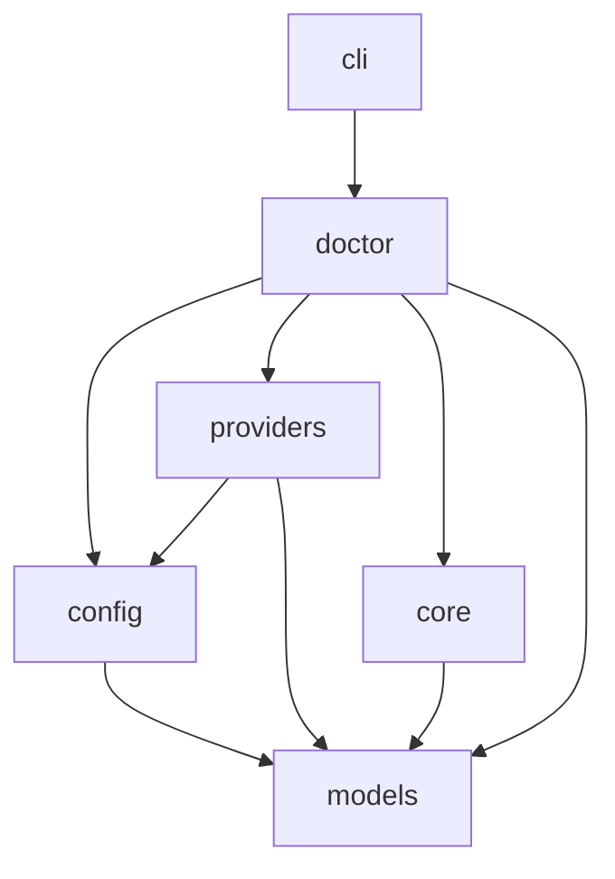

# FSQ Doctor Design

## Goal

Add an OpenClaw-style `fsq-agent doctor` experience that diagnoses whether the current checkout is ready for dynamic LLM execution, strict-core execution, and provider-backed AI assertions. In an interactive terminal it may offer a narrowly allowlisted set of safe repairs; in automation it remains deterministic and non-interactive. The command must perform local connectivity checks, continue after independent failures, explain every warning or failure, and avoid leaking secrets.

## Scope

- Add a public `doctor` CLI command with automatic platform detection and an explicit platform override.
- Diagnose the Python environment, repository preset, `.env`, managed workspace, selected execution mode, provider, and selected platform backend.
- Diagnose source-checkout/install integrity so dependency-manager or interpreter mismatches are distinguished from platform failures.
- Support human-readable and stable JSON output.
- Perform bounded local and network connectivity probes without model inference or target-workflow execution.
- Return mode-aware exit codes suitable for both interactive troubleshooting and CI.
- Provide TTY-aware guided diagnosis, explicit non-interactive operation, and an allowlisted `--repair` mode.
- Back up operator-owned files before any safe repair and rerun affected checks afterward.
- Add platform probes for Android, Web, Windows, and macOS.
- Include an explicit Android SDK Platform-Tools/ADB installation and execution check before device checks.
- Document command usage and remediation behavior.

## Non-Goals

- Do not provide unrestricted, plugin-defined, or arbitrary-command repair execution.
- Do not modify repository-owned platform presets or source files.
- Do not install Python extras, ADB, browsers, Appium, drivers, or applications.
- Do not launch a target Android, Windows, or macOS application.
- Do not execute a user FSQ case or a dynamic task.
- Do not navigate a browser to a target site or use a real browser profile.
- Do not create an Appium Mac2 session.
- Do not start GitHub device-code authentication.
- Do not send an Azure OpenAI or GitHub Copilot model inference request.
- Do not add a general plugin framework for third-party doctor checks.
- Do not change the behavior of existing `init`, `run`, `report`, or `playground` commands.
- Do not automatically repair malformed `.env` content, delete unknown settings, remove non-empty directories, request administrator privileges, or execute remediation commands shown to the user.

## Confirmed Public Behavior

### Command Shape

```text
fsq-agent doctor [--platform android|web|windows|macos] [--mode dynamic|strict|all] [--format text|json] [--non-interactive] [--repair]
```

Defaults:

- `--mode all`
- `--format text`
- no explicit platform; doctor attempts automatic platform detection
- interactive guidance when both standard input and output are attached to an interactive terminal

The public command remains rooted in the current directory. It does not expose a workspace or config path override.

### Interaction And Repair Modes

`fsq-agent doctor` chooses presentation behavior from terminal capability:

- Interactive terminal: run diagnosis, prompt for unresolved platform/mode choices when needed, present safe repairs one at a time, and offer to rerun affected checks after the user applies or declines a repair.
- Non-interactive terminal, redirected input/output, CI, or `--non-interactive`: run the complete diagnosis without prompts or repairs.
- `--repair`: apply all eligible safe repairs without per-repair confirmation, then rerun affected checks. It is intended for automation but retains the same narrow allowlist.
- `--format json`: implies non-interactive diagnosis, never repairs, and is incompatible with `--repair`.
- Explicit `--non-interactive --repair` is valid and applies only allowlisted safe repairs.

When `--mode` is omitted interactively, doctor asks which target to diagnose with `all` as the default selection. When it is omitted non-interactively, it resolves directly to `all`. An explicitly supplied `--mode` is never prompted again.

If only one of standard input or output is interactive, doctor behaves non-interactively so prompts cannot become hidden or block a pipeline. User cancellation exits without applying the pending repair; already completed atomic repairs remain reported in the final summary.

Allowed safe repairs are limited to:

- initialize a missing current-directory `.fsq-agent-workspace` using the existing workspace contract;
- add the workspace marker only when the workspace directory exists and is empty;
- update explicitly supplied non-secret platform values in `.env`: Android app id/serial, Web browser executable path, Windows app path/backend/window regex/launch arguments, and macOS Appium URL/bundle id/app path;
- refresh a short-lived Copilot provider token from an already valid cached GitHub OAuth token.

Environment-value repairs require values explicitly entered during an interactive prompt; `--repair` never invents values and skips input-required repairs when running non-interactively. Before changing an existing `.env`, doctor writes a sibling backup using a collision-safe timestamped name and reports that path. The backup preserves existing access controls where supported and receives owner-only permissions best-effort on platforms that expose them; its contents are never printed. The update preserves comments, ordering, unrelated assignments, and line-ending style where practical. It must refuse to modify a malformed `.env` or overwrite an existing backup. New values are validated before writing, the write is atomic, and the affected configuration/platform checks rerun after the update. Creating a new `.env` requires no empty backup.

Interactive prompts must not collect API keys, passwords, runtime secrets, or account credentials. Provider authentication remains delegated to `fsq-agent init --platform <platform> --provider <provider>`. Dependency installation, ADB/Appium service control, browser/application launch, administrator operations, preset edits, and cleanup of non-empty directories remain user-run fixes only.

### Platform Detection

When `--platform` is supplied, that value always wins. Environment variables for other platforms do not create an ambiguity, although conflicting or unused local configuration may be reported as a warning when useful.

When `--platform` is omitted, doctor identifies configured platform candidates from effective local environment values:

- Android: `FSQ_ANDROID_APP_ID` or `FSQ_ANDROID_SERIAL`
- Web: `FSQ_WEB_BROWSER_EXECUTABLE_PATH`
- Windows: `FSQ_WINDOWS_APP_PATH`
- macOS: `FSQ_MACOS_APPIUM_SERVER_URL`, `FSQ_MACOS_BUNDLE_ID`, or `FSQ_MACOS_APP_PATH`

Effective values follow existing precedence: a nonblank process environment value overrides the corresponding `.env` value. Doctor uses a read-only parser and must not mutate `os.environ` merely to detect candidates.

Detection outcomes:

- Exactly one candidate: select it and report `platform_source` as automatic environment detection.
- No candidates in interactive mode: prompt the user to choose one of the four supported platforms and report `platform_source` as interactive selection.
- Multiple candidates in interactive mode: show only candidate platform names, prompt the user to choose one, and report `platform_source` as interactive selection.
- No or multiple candidates in non-interactive mode: return usage exit code `2`, list the relevant platform names or platform-defining environment-variable names, and recommend an explicit `--platform`.
- Explicit platform: report `platform_source` as the CLI option.

Platform detection must never print values of environment variables.

### Mode Semantics

`dynamic` checks whether a normal goal/raw-case LLM run can start. It requires:

- environment and workspace readiness,
- selected platform readiness,
- selected model-provider readiness and connectivity.

`strict` checks whether a strict-core run can start without assuming a specific case. It requires:

- environment and workspace readiness,
- selected platform readiness.

It does not require a model provider. Because no case is supplied, potential runtime-secret references are warnings rather than blockers, and provider-backed `assertWithAI` is evaluated separately.

`all` evaluates and displays three independent readiness targets:

- Dynamic LLM
- Strict core
- AI assertion

AI assertion readiness requires both selected platform readiness and provider readiness. A failure must affect only the targets that depend on it. For example, missing Copilot credentials fail Dynamic LLM and AI assertion but do not fail Strict core.

For `dynamic` and `strict`, readiness targets outside the requested mode are reported as `NOT CHECKED`. For `all`, any failed target makes the command exit `1`.

### Side-Effect Boundary

Diagnosis itself does not modify the workspace, `.env`, configuration, applications, or run artifacts. Persistent changes occur only through the allowlisted safe-repair flow described above. Every attempted repair is recorded as applied, declined, skipped, or failed without exposing entered values.

A GitHub Copilot readiness check may use a valid cached GitHub OAuth token to exchange and cache a refreshed short-lived Copilot provider token. This bounded cache refresh is treated as an eligible safe repair rather than an implicit diagnostic side effect. It is allowed only when the managed workspace and auth directory already exist; doctor must not create a missing workspace solely to enable it.

The Web probe may start a short-lived isolated Chrome process with a temporary profile solely to prove executable startup, then immediately terminate it and delete its temporary directory. This is a diagnostic resource, not an FSQ browser session: it must not navigate, load a user profile, or invoke Web platform capabilities.

### Network Behavior

Online connectivity probes run by default. They use short, bounded timeouts and never send model inference requests.

Permitted network or local-service activity includes:

- non-interactive GitHub/Copilot credential validation or token exchange,
- Azure endpoint DNS/TLS/HTTP reachability,
- local or configured Appium `/status` access,
- ADB/uiautomator2 communication with the selected Android device.

Default per-probe timeout is five seconds unless a backend operation needs a separately bounded timeout. A failed probe must not indefinitely block later independent checks.

## Check Result Contract

Each check has a stable machine identifier, category, status, summary, affected readiness targets, ordered fixes, and sanitized metadata.

Execution statuses are:

- `PASS`: the condition is ready.
- `WARN`: the condition does not block the requested target but may limit behavior or reliability.
- `FAIL`: the condition blocks one or more requested targets.
- `SKIP`: the check was not safely executable because a prerequisite failed or the check was outside the requested scope.

`SKIP` is not silently treated as success. A skipped dependent check inherits no new failure, but its failed prerequisite already determines affected readiness.

Every `WARN` and `FAIL` must include at least one actionable `DoctorFix`. Fix data supports:

- a required human action description,
- an optional copyable command,
- an optional copyable verification command,
- an optional environment variable name,
- an optional documentation URL.

Fixes must identify the actual detected problem. Generic advice such as “check configuration” is insufficient. Commands use the current operating system’s command style where applicable. Placeholder values must be visibly marked as placeholders. Where a repair can be verified safely, the result should include a separate verification command rather than making the user infer how to confirm the fix.

An eligible fix may also reference a stable safe-repair action id. Applied repairs are represented separately from check results with action id, sanitized target, status (`applied`, `declined`, `skipped`, or `failed`), backup path when applicable, and the ids of checks rerun afterward. Repair records never contain the new environment value.

## Checks And Decision Rules

Checks run in stable order. Failure of one item skips only checks that depend on it; independent checks continue so one invocation provides a useful aggregate diagnosis.

### Base Environment

All modes check:

- Python version satisfies the project requirement `>=3.11`.
- The installed `fsq-agent` package and required core dependencies can be imported.
- The active interpreter and imported `fsq-agent` package resolve from a coherent environment; a source checkout accidentally using an unrelated globally installed package is reported with an `uv run fsq-agent doctor ...` remediation.
- When running from a source checkout, `pyproject.toml` is readable and the expected project environment/dependency-manager state is present. Missing or mismatched installation state is distinguished from a missing platform extra.
- The current directory exists and is accessible.
- The selected committed platform preset exists, is readable, parses as YAML, and declares the selected platform.
- The current-directory `.env`, when present, has valid supported assignment syntax.
- Effective process-environment precedence is recognized; conflicting process and `.env` assignments may produce a non-secret warning.
- The expected `.fsq-agent-workspace` path is a directory, contains the expected marker, and is readable and writable.

Workspace decisions:

- Correctly initialized workspace: `PASS`.
- Missing workspace: `FAIL`; offer the allowlisted workspace initialization repair, or recommend `fsq-agent init --platform <platform>` when repairs are disabled.
- Workspace path is not a directory: `FAIL`; recommend backing up or moving the conflicting path before initialization.
- Non-empty unmarked workspace: `FAIL`; explain that doctor will not adopt or delete it and recommend backup/inspection before initialization.
- Empty workspace with a missing marker: `FAIL`; offer the marker repair.
- Non-empty workspace with a missing marker or insufficient access: `FAIL` with a targeted user-run permission or initialization fix; no automatic adoption.

These checks require a new read-only configuration-loading path. The existing runtime loader creates workspace and output paths and therefore cannot be reused directly for doctor.

Base checks use safe install provenance such as interpreter version, package origin category, and dependency presence. They must not dump the complete `PATH`, Python search path, package metadata, or arbitrary environment values.

### Configuration And Mode Inputs

Read-only configuration validation checks:

- preset/settings schema,
- platform/backend compatibility,
- environment overlays,
- local path syntax and existence,
- provider-local fields when provider checks are requested,
- runtime-secret allowlist shape.

Doctor must separate schema/normalization from path creation. Existing runtime loading behavior remains unchanged.

Malformed configuration must not collapse the whole diagnostic into one exception. Doctor reports the exact sanitized schema/path issues, then continues with independent raw-environment, workspace, dependency, and executable/service checks that do not require a valid `Settings` instance. Checks that truly require normalized settings are `SKIP` with the configuration failure as their prerequisite. This best-effort behavior is diagnostic only; doctor must not silently normalize, discard, migrate, or rewrite invalid keys.

Without a specific strict case, allowlisted runtime-secret names that currently have no value produce `WARN`; doctor does not know whether a future case will reference them. Values are never read into output.

### Provider

Provider checks run for `dynamic` and `all`, but not for `strict` alone.

#### GitHub Copilot

The probe checks:

- expected OAuth and provider-token cache locations,
- cache readability and JSON shape,
- token expiration status without exposing tokens,
- non-interactive readiness,
- GitHub/Copilot endpoint reachability with bounded timeouts.

A valid provider token passes without model invocation. If the provider token is missing or expired but a valid cached GitHub OAuth token exists, the probe may perform the existing non-interactive plan/token exchange and refresh the provider-token cache. It must never start device-code authentication.

If no usable cache path exists, the fix recommends:

```text
fsq-agent init --platform <platform> --provider github_copilot
```

Diagnostics may report provider name, cache path, expiry state, HTTP status class, or plan, but never OAuth tokens, Copilot tokens, authorization headers, cookies, or secret-bearing response bodies.

#### Azure OpenAI

The probe checks:

- `AZURE_OPENAI_BASE_URL` is present and normalizes to the required `/openai/v1/` form,
- `AZURE_OPENAI_MODEL` is present,
- `AZURE_OPENAI_API_KEY` is present and is not a placeholder,
- endpoint URL parsing, DNS, TLS, and bounded HTTP reachability.

No inference request is sent. A pass proves only local configuration and endpoint reachability, not model deployment existence, API-key authorization, quota, or inference success. The output must state this limitation.

The API key is represented only as set, missing, or placeholder. It must not expose value, length, prefix, suffix, or derived fingerprint.

### Android

Android checks execute in this order:

1. Locate `adb` through `PATH`.
2. Run bounded `adb version` and capture only a sanitized version summary.
3. Run bounded `adb devices` and classify device states.
4. Select the configured or unique online device.
5. Check the `uiautomator2` Python dependency.
6. Establish bounded uiautomator2 communication and read basic device information.
7. Verify `FSQ_ANDROID_APP_ID` is configured.
8. Verify the target package is installed without starting or stopping it.

ADB decisions and fixes:

- Missing from `PATH`: `FAIL`; recommend installing Android SDK Platform-Tools and adding its directory to `PATH`, followed by `adb version` verification.
- Command cannot execute: `FAIL`; recommend checking permissions, installation integrity, and local security policy.
- ADB server error: `FAIL`; explain the failure and offer `adb kill-server` followed by `adb start-server` as user-run remediation. Doctor does not restart it automatically.
- No device: `FAIL`; recommend connecting a device or starting an emulator.
- `unauthorized`: `FAIL`; recommend unlocking the device and accepting USB debugging authorization.
- `offline`: `FAIL`; recommend reconnecting the device or restarting ADB.
- Multiple online devices with no serial: `FAIL`; recommend setting `FSQ_ANDROID_SERIAL`.
- Configured serial missing or not in `device` state: `FAIL`; identify the configured selection by safe status only and recommend correcting `FSQ_ANDROID_SERIAL`.
- Exactly one online device with no serial: `PASS` and select it for later probes.

Device listings must avoid dumping unrelated device metadata. Subprocess output is size-limited and sanitized.

Dependency, communication, and package fixes distinguish installation of the Android Python extra, uiautomator2 communication/service problems, `FSQ_ANDROID_APP_ID` setup, and target APK installation.

### Web

Web checks:

- `playwright` Python package can be imported,
- `FSQ_WEB_BROWSER_EXECUTABLE_PATH` is configured,
- resolved path exists and is a file,
- executable name matches the configured Chrome channel policy,
- the executable can start in an isolated temporary profile under a bounded timeout and immediately terminate.

The startup probe does not navigate, create an FSQ page, use a real user profile, or call `startBrowser`. It must clean up processes and temporary files on pass, failure, timeout, and interruption where possible.

Fixes distinguish installing the Web extra, installing Chrome, correcting the executable path, resolving permissions, and investigating endpoint/security software that prevents process startup.

### Windows

Windows checks:

- host operating system is Windows,
- `pywinauto` and Pillow can be imported,
- `FSQ_WINDOWS_APP_PATH` is configured, points to a readable file, and is suitable as an executable target,
- `FSQ_WINDOWS_BACKEND_KIND` is `uia` or `win32`,
- optional `FSQ_WINDOWS_WINDOW_TITLE_RE` compiles,
- optional `FSQ_WINDOWS_LAUNCH_ARGS` parses with existing Windows command-line semantics.

Doctor does not launch the application. Therefore a statically valid Windows target produces a warning that window discovery and control-tree automation have not been proven. That warning does not block readiness.

Fixes distinguish installing the Windows extra, correcting the app path, backend kind, title regex, or launch arguments, and running a real case to validate the target’s accessibility surface.

### macOS

macOS checks:

- host operating system is macOS,
- Appium Python Client can be imported,
- Appium server URL is syntactically valid,
- bounded `/status` request succeeds and reports usable server state,
- server status identifies Mac2 as available when the server exposes driver inventory,
- at least one of bundle id or app path is configured,
- configured app path exists and is usable.

The probe does not create an Appium session or launch the application. Therefore a statically valid target produces a warning that application session creation and accessibility automation have not been proven. That warning does not block readiness.

Fixes distinguish installing the macOS Python extra, installing or starting Appium, installing the Mac2 driver, correcting the server URL, and setting a valid bundle id or app path.

### Resource Cleanup And Failure Isolation

- Every subprocess and network request is bounded.
- Captured subprocess output has a fixed upper bound.
- Temporary browser profiles are removed best-effort.
- Child browser processes are terminated best-effort on all paths.
- Provider sessions and HTTP clients are closed.
- A probe exception becomes a sanitized result with a stable check id.
- `KeyboardInterrupt` and process-termination exceptions are not converted to ordinary check failures.
- Dependent checks use `SKIP` after a prerequisite failure to prevent cascading false diagnoses.

The orchestration is organized into explicit phases—preflight/install, configuration/workspace, provider, platform connectivity, and readiness summary—so checks with unrelated prerequisites can continue. The phase structure is an implementation organization aid and is not an additional public status dimension.

## Output Design

### Text

Default text output is grouped by category and does not rely on color for meaning. Passing checks remain concise; warnings and failures expand their impact and remediation:

```text
FSQ Doctor

Platform: android (auto-detected from FSQ_ANDROID_APP_ID)
Mode: all

Environment
  PASS  Python 3.12 satisfies >=3.11
  PASS  Workspace is initialized

Android
  FAIL  adb was not found on PATH
        Impact: dynamic, strict, ai-assertion
        Fix: Install Android SDK Platform-Tools.
        Fix: Add the platform-tools directory to PATH.
        Verify: adb version

Provider
  PASS  GitHub Copilot cached credentials are usable

Readiness
  FAIL  Dynamic LLM
  FAIL  Strict core
  FAIL  AI assertion

Summary: 4 passed, 0 warnings, 1 failed, 3 skipped
```

The output always displays all three readiness targets; targets outside the requested mode display `NOT CHECKED`.

Interactive text output uses clear prompts but never relies on color alone. After diagnosis it groups eligible safe repairs, states exactly which file or workspace contract would change, asks before each repair unless `--repair` is active, reports any backup, and displays the rerun result. Ineligible fixes remain printed as commands with verification steps. The final summary includes applied, declined, skipped, and failed repair counts.

### JSON

`--format json` writes one valid JSON document to standard output. Routine logging must not pollute standard output. The schema starts at version `1` and includes:

- `schema_version`
- `platform`
- `platform_source`
- `requested_mode`
- `status`
- `exit_code`
- ordered `checks`
- ordered `repairs`
- `readiness`
- `summary`

Each check includes:

- stable `id`, for example `environment.python_version`, `workspace.initialized`, `android.adb.installed`, `android.adb.devices`, `android.package.installed`, or `provider.github_copilot.credentials`,
- category,
- status,
- summary,
- affected targets,
- ordered fixes,
- sanitized metadata.

Adding a check does not require a schema-version change. Removing or renaming fields, or changing their established meaning, does.

JSON reports always have an empty `repairs` array because JSON mode is diagnosis-only. Text-mode interaction and repair transcripts are not encoded into JSON by redirecting terminal prompts.

## Exit Codes

- `0`: every requested readiness target is ready; warnings may exist.
- `1`: one or more requested readiness targets has a blocking failure.
- `2`: command usage cannot be resolved, including invalid option combinations, unavailable interaction when explicitly required, or unresolved non-interactive platform detection.
- `130`: user interruption.

Automatic platform-detection errors still produce a valid text or JSON diagnostic response before exit.

## Architecture And Module Ownership

### Chosen Approach

Use a dedicated `fsq_agent.doctor` application module rather than embedding checks in CLI or introducing a generic plugin framework.

`doctor` uses Python Architecture Level 3, Layered Application. It coordinates several external boundaries and computes use-case-specific readiness, but the domain is not rich enough for Clean Architecture or DDD. Platform/provider probes remain small boundary services rather than pass-through abstraction layers.

### `doctor`

Owns:

- `DoctorService` orchestration,
- request handling after CLI parsing,
- check ordering and prerequisite relationships,
- conversion of config/provider/core probe facts into doctor checks,
- readiness and exit-code calculation,
- text and JSON rendering.

Internal implementation files remain private. The public module API should expose the stable service and request/report boundary required by CLI, not concrete individual checker implementations.

The implementation should keep orchestration, check families, and renderers in focused private files rather than growing one monolithic command module. This mirrors the useful decomposition in OpenClaw while retaining FSQ's typed result contract and module DAG.

### `models`

Owns shared boundary data that crosses modules, including conceptually:

- `DoctorCheckResult`
- `DoctorFix`
- `DoctorReadiness`
- status and affected-target types
- provider/platform-neutral probe fact/result structures when a shared cross-module contract is justified

These are data contracts only. They do not execute probes, render CLI output, or depend on doctor.

### `config`

Owns a new read-only settings inspection path that:

- parses platform presets and `.env`,
- applies effective environment precedence without mutating process environment,
- validates and normalizes settings,
- computes expected runtime paths,
- does not create workspace, marker, output, or runs directories.

The current mutating runtime loader remains unchanged for normal commands. Config additionally owns reusable, atomic `.env` document update and workspace-initialization primitives so CLI provider setup and doctor safe repair do not implement competing file formats. Those primitives preserve unrelated content and expose facts/operations rather than doctor prompts or rendering. Config does not depend on doctor.

### `providers`

Owns a public non-interactive provider diagnostic boundary that:

- interprets provider-specific settings and caches,
- validates local provider readiness,
- performs bounded provider endpoint probes,
- exposes an explicit safe refresh operation for the existing Copilot provider-token cache from a valid cached GitHub OAuth token,
- never authenticates interactively or invokes a model,
- returns sanitized provider facts independent of doctor formatting.

Providers does not depend on doctor, CLI, or core.

### `core`

Owns a platform diagnostic factory and private backend probes because backend imports, commands, and connectivity details belong beside the platform runtime boundary:

- Android: ADB, device, uiautomator2, and package checks.
- Web: Playwright dependency, browser executable, and isolated startup check.
- Windows: host/dependency/target static checks.
- macOS: host/dependency/Appium/Mac2/target checks.

Core returns platform-neutral sanitized probe results and does not own doctor text, JSON, readiness, or CLI semantics. It continues to depend only on models and capabilities among project modules; doctor-specific conversion remains in doctor.

### `cli`

The CLI command is a thin adapter:

- parse `--platform`, `--mode`, `--format`, `--non-interactive`, and `--repair`,
- determine whether both input and output support interaction,
- create the doctor request,
- call `DoctorService`,
- emit the selected rendering,
- return the report’s exit code.

JSON mode must isolate routine logs from standard output.

### Dependency Direction



No dependency cycle is introduced. `core`, `providers`, and `config` must not import doctor.

## Control Flow

1. CLI validates option combinations, detects terminal interaction capability, and creates a request.
2. Doctor reads process and `.env` presence facts without mutation.
3. Doctor resolves explicit or automatic platform selection, prompting only in interactive mode when selection is unresolved.
4. Config performs read-only preset/settings inspection and computes expected paths.
5. Doctor executes base checks.
6. Doctor executes mode-relevant provider checks and selected platform checks, honoring prerequisites.
7. Doctor presents eligible repairs interactively or applies them under `--repair`; declined and ineligible fixes remain actionable guidance.
8. Each applied repair is verified by rerunning only its affected checks and dependents.
9. Boundary and repair exceptions are converted into sanitized stable results.
10. Doctor computes independent Dynamic LLM, Strict core, and AI assertion readiness from the final check state.
11. Doctor renders text or versioned JSON.
12. CLI exits with the report’s exit code.

## Security And Redaction

Doctor output must not contain:

- API keys,
- OAuth or Copilot tokens,
- authorization headers,
- cookies,
- runtime secret values,
- secret lengths or fingerprints,
- credential-bearing URL user-info or query values,
- unbounded external command or HTTP response bodies.

URLs are sanitized by removing user-info and query/fragment data when reporting them. Environment variables are reported by name and presence state only. Provider and subprocess exceptions are normalized before inclusion in result metadata.

## OpenClaw Reference Review

The design was cross-checked against the local OpenClaw doctor implementation under `C:\Users\toyu\code\github\openclaw`. OpenClaw's doctor is primarily an interactive repair and migration wizard: its main command composes focused config, authentication, state, security, service, health, and workspace helpers; it provides concrete commands and log locations; it continues with best-effort configuration when possible; and it separates optional deeper service discovery from ordinary health work.

The following proven ideas are adopted for FSQ:

- Keep the top-level command as orchestration and split check families into focused private modules.
- Diagnose installation provenance before blaming runtime backends.
- Continue independent checks after malformed configuration and mark only true dependents as skipped.
- Pair a problem with a concrete repair command and, where safe, a separate verification command.
- Report effective environment precedence explicitly because stale higher-precedence values can make correct file configuration appear broken.
- Bound live health probes and preserve connection/service context needed for remediation.
- Make cleanup and post-repair verification guidance platform-specific.

The following OpenClaw behavior is intentionally narrowed or not copied:

- FSQ adopts TTY-aware guidance and `--repair`, but repairs are a closed, typed allowlist. It does not gain unrestricted `--fix`, `--yes`, legacy migrations, token generation, service restarts, arbitrary config normalization, or supervisor rewrites.
- FSQ keeps stable typed check ids, JSON output, readiness targets, and documented exit codes instead of presentation-only notes.
- FSQ performs its selected platform connectivity probes by default rather than using a generic `--deep`; its purpose is pre-run readiness, not discovery of duplicate system services.
- FSQ does not offer package updates before diagnosis and does not stamp wizard metadata.
- FSQ does not treat invalid configuration as a candidate to normalize or strip; it reports exact issues and supplies user-run remediation.
- FSQ never prompts for secrets through doctor and delegates provider login/setup to `init --provider`.

## Expected SPEC Changes

- Root `SPEC.md`: add doctor as a public readiness/diagnostic and safe-repair workflow, add the doctor module to the module table and architecture DAG, and state the interaction, side-effect, and local-connectivity guarantees.
- `fsq_agent/models/SPEC.md`: specify shared doctor/probe result models and public exports.
- `fsq_agent/config/SPEC.md`: specify the read-only settings inspection API, atomic backup-preserving `.env` updates, and constrained workspace initialization primitives.
- `fsq_agent/providers/SPEC.md`: specify the non-interactive, no-inference provider probe and explicit bounded cache-refresh repair.
- `fsq_agent/core/SPEC.md`: specify platform probe factory/interfaces and backend ownership.
- `fsq_agent/cli/SPEC.md`: add the command surface, TTY behavior, option compatibility, output formats, platform detection, mode semantics, and exit codes.
- New `fsq_agent/doctor/SPEC.md`: specify DoctorService, public behavior, safe-repair allowlist, internal structure, dependency direction, output contract, and readiness aggregation.
- `README.md`: document interactive/non-interactive examples, `--repair`, backups, output interpretation, online checks, and platform-specific remediation.

## Verification Expectations

Verification must cover:

- zero, one, and multiple automatically detected platforms,
- explicit platform precedence,
- interactive platform selection and user cancellation,
- automatic non-interactive fallback when input or output is not a TTY,
- `--non-interactive`, `--repair`, and invalid JSON/repair combinations,
- `dynamic`, `strict`, and `all` readiness aggregation,
- text and JSON output stability,
- exit codes `0`, `1`, and `2`,
- actionable fixes for every warning and failure,
- secret/token/header/credential-bearing URL redaction,
- diagnosis-only config inspection creating or modifying no files,
- safe workspace initialization and empty-workspace marker repair,
- `.env` backup naming, atomic update, content/line-ending preservation, validation-before-write, and refusal on malformed input,
- applied/declined/skipped/failed repair records with no repaired values,
- affected-check reruns and final readiness based on post-repair state,
- source-checkout/global-install mismatch and missing project-environment diagnostics,
- malformed configuration still allowing independent best-effort checks,
- JSON standard output containing no routine logs,
- provider checks performing no interactive authentication or model inference,
- explicit Copilot cache refresh repair only within an existing initialized workspace,
- proof that doctor prompts never collect secrets or trigger provider device-code authentication,
- ADB missing, version failure, server failure, no device, multiple devices, unauthorized, offline, and configured-serial mismatch,
- Android dependency, uiautomator2 communication, app-id, and package checks,
- Web dependency, path, process startup, timeout, and cleanup paths,
- Windows host, dependency, path, backend, regex, and argument checks,
- macOS host, dependency, URL, Appium status, Mac2, and target checks,
- bounded timeouts, exception isolation, prerequisite skips, and resource cleanup.

Tests should use injected fake probes, fake commands, bounded fake HTTP services, and temporary executables. CI must not require a real device, Chrome installation, Appium server, desktop application, provider credential, or live cloud endpoint.

Focused verification should include CLI, config, providers, core platform probes, doctor service, and renderers, followed by the full test suite and Ruff. A final spec/implementation audit is required before completion.

## Resolved Design Decisions

- Diagnostic depth: local connectivity, without model calls or target workflow execution.
- Platform selection: automatic from effective environment configuration, with explicit override and ambiguity errors.
- Exit behavior: warnings return success; blocking issues return failure.
- Interaction: default guided mode only when both input and output are interactive; otherwise deterministic non-interactive diagnosis.
- Remediation: interactive confirmation or `--repair` applies only the confirmed safe-repair allowlist; all other fixes remain user-run.
- Remediation entries include verification commands when a safe verification exists.
- Output: human-readable text plus stable diagnosis-only JSON; no diagnostic report file.
- Network: online probes enabled by default with bounded timeouts.
- Modes: `dynamic`, `strict`, and `all`, defaulting to `all`.
- Architecture: dedicated Level 3 doctor application module.
- Android prerequisite: explicit ADB installation, version, server, and device-state diagnosis.
- OpenClaw reference: adopt TTY-aware guidance, focused checker decomposition, install provenance, best-effort diagnosis, and concrete repair/verification hints while narrowing repairs and rejecting migration/service-management behavior.

## Confirmation State

The command behavior, check scope, Android ADB addition, module boundaries, output contract, exit codes, and verification expectations were confirmed during design review beginning on 2026-08-04. On 2026-08-06, the design was revised and confirmed to adopt OpenClaw-style TTY-aware interaction plus a narrowly allowlisted safe-repair mode.
